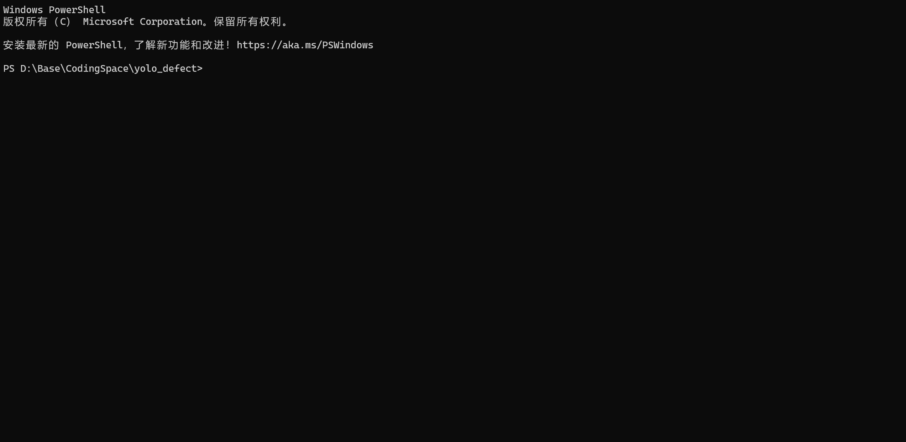
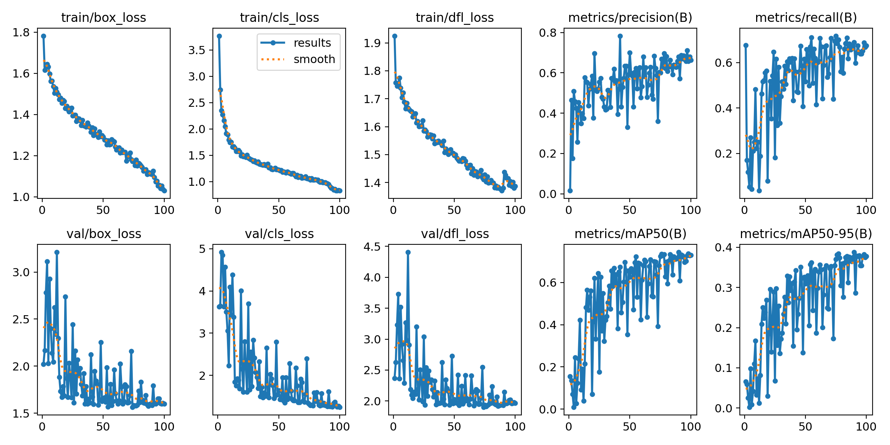
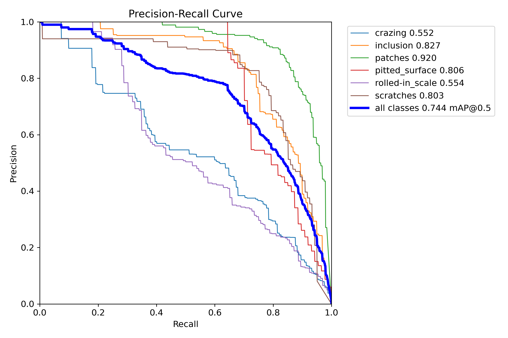
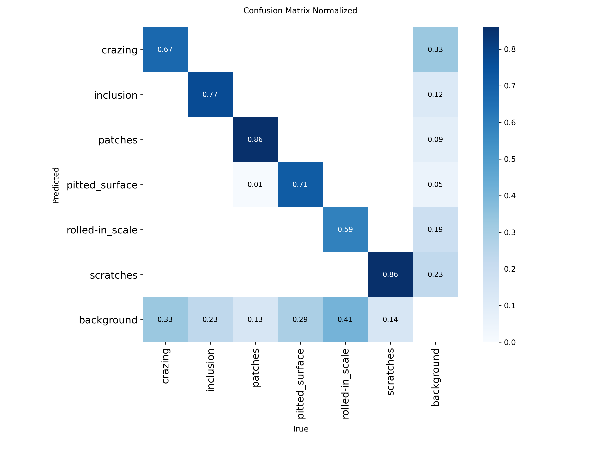
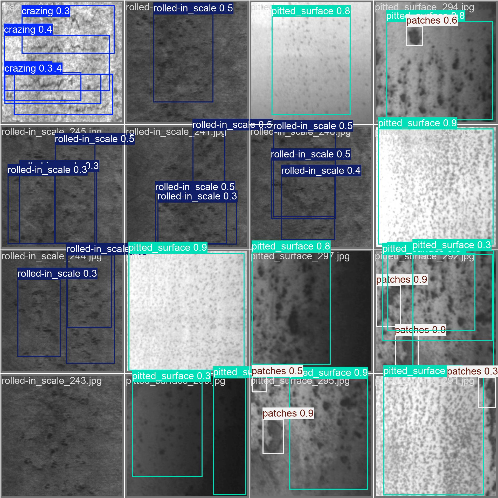

# Steel Surface Defect Detection with YOLOv8

[中文版](README_zh.md)


End-to-end industrial defect detection pipeline: from data preparation to ONNX deployment, built on the NEU-DET steel surface dataset with YOLOv8.



## Highlights

- **Best Experimental Result** — Best checkpoint `final_train_2` reaches **mAP@0.5 = 0.743** on NEU-DET
- **PyTorch vs ONNX Consistency Check** — 50-image comparison shows **50/50** identical detection-count matches, with total detections **146 vs 146**
- **Inference Speed Benchmark** — PyTorch CPU **8.43 FPS**; ONNX CPU **24.1 FPS**; ONNX GPU (RTX 3060) **56.4 FPS** — all measured on 100 timed images (5 warmup)
- **Docker Verified** — `python:3.9-slim` image has been tested with `/health` and `/detect`
- **Clone & Run** — Dataset (28MB) included in the repo, no external downloads needed

## Key Metrics

| Metric | Value |
|--------|-------|
| Best model | `final_train_2` |
| mAP@0.5 | **0.743** |
| mAP@50-95 | **0.388** |
| PT/ONNX same-count ratio | **50 / 50** images (**100%**) |
| Mean abs count diff | **0.000** |
| PyTorch CPU benchmark | **8.43 FPS** / **118.66 ms** per image |
| ONNX CPU benchmark | **24.1 FPS** / **41.4 ms** per image |
| ONNX GPU benchmark (RTX 3060) | **56.4 FPS** / **17.7 ms** per image |
| Model size (`best.pt` / `best.onnx`) | ~6.0 MiB / ~11.8 MiB |

## Quick Start

```bash
# Clone (dataset included, ~28MB)
git clone https://github.com/LiuSiChengGitHub/yolo_defect.git
cd yolo_defect

# Install dependencies
conda env create -f environment.yml
conda activate yolo_defect

# Prepare data (VOC XML -> YOLO TXT)
python scripts/prepare_data.py

# Train
python scripts/train.py

# Export ONNX from the default training output
python scripts/export_onnx.py --weights runs/detect/train/weights/best.pt

# Inference on a real validation image
python scripts/inference_onnx.py --model models/best.onnx --image data/images/val/crazing_241.jpg
```

## Dataset

### NEU-DET: Northeastern University Surface Defect Database

**Source:** [NEU Surface Defect Database](http://faculty.neu.edu.cn/songkechen/zh_CN/zdylm/263270/list/)

The NEU-DET dataset contains 1,800 grayscale images of hot-rolled steel strip surfaces, covering 6 types of typical surface defects:

| Class | English | Chinese | Description |
|-------|---------|---------|-------------|
| 0 | crazing | 龟裂 | Network of fine cracks on the surface |
| 1 | inclusion | 夹杂 | Foreign material embedded in the steel |
| 2 | patches | 斑块 | Irregular discolored areas |
| 3 | pitted_surface | 麻面 | Small pits scattered across the surface |
| 4 | rolled-in_scale | 压入氧化铁皮 | Oxide scale pressed into the surface during rolling |
| 5 | scratches | 划痕 | Linear marks from mechanical contact |

### Statistics

- **Dataset paper / official description:** 1,800 images (300 per class)
- **Files bundled in `data/NEU-DET/`:** 1,800 readable JPG images
- **Image size:** 200 x 200 pixels
- **Format:** JPG (grayscale, 1 channel in annotation but readable as 3-channel)
- **Generated YOLO copy in `data/images/`:** 1,439 train + 361 val images

### Directory Structure

The dataset is pre-split and included at `data/NEU-DET/`:

```
data/NEU-DET/
├── train/                         # 1,439 readable images
│   ├── annotations/               # VOC XML (flat directory)
│   │   ├── crazing_1.xml
│   │   ├── inclusion_1.xml
│   │   └── ...
│   └── images/                    # JPG (subdirectories by class)
│       ├── crazing/
│       ├── inclusion/
│       ├── patches/
│       ├── pitted_surface/
│       ├── rolled-in_scale/
│       └── scratches/
└── validation/                    # 361 XMLs, 361 readable images
    ├── annotations/
    └── images/                    # Same structure as train
```

### Annotation Format

VOC XML format with `<bndbox>` containing absolute pixel coordinates:

```xml
<object>
    <name>crazing</name>
    <bndbox>
        <xmin>2</xmin>
        <ymin>2</ymin>
        <xmax>193</xmax>
        <ymax>194</ymax>
    </bndbox>
</object>
```

Each image may contain multiple bounding boxes (multiple defect instances).

## Data Preparation

### What the conversion does

`prepare_data.py` converts the original VOC XML annotations to YOLO TXT format that Ultralytics YOLOv8 expects.

**VOC XML format** (absolute pixel coordinates):
```
xmin, ymin, xmax, ymax  →  e.g., 2, 2, 193, 194
```

**YOLO TXT format** (normalized center coordinates):
```
class_id cx cy w h  →  e.g., 0 0.487500 0.490000 0.955000 0.960000
```

The normalization formula:
- `cx = (xmin + xmax) / 2 / image_width`
- `cy = (ymin + ymax) / 2 / image_height`
- `w = (xmax - xmin) / image_width`
- `h = (ymax - ymin) / image_height`

### Class Mapping

| Class Name | Class ID |
|------------|----------|
| crazing | 0 |
| inclusion | 1 |
| patches | 2 |
| pitted_surface | 3 |
| rolled-in_scale | 4 |
| scratches | 5 |

### Run

```bash
python scripts/prepare_data.py
# or specify custom paths:
python scripts/prepare_data.py --data-root data/NEU-DET --output-dir data
```

### Output Structure

```
data/
├── images/
│   ├── train/          # Flat directory, all training images
│   └── val/            # Flat directory, all validation images
├── labels/
│   ├── train/          # YOLO TXT labels, one per image
│   └── val/
└── data.yaml           # YOLO dataset config
```

### Important Notes

- The dataset is **already split** into train/validation — no random splitting needed
- `rolled-in_scale` contains a hyphen, so the script uses known class name prefix matching (longest match first) instead of naive underscore splitting
- Images are copied from class subdirectories to a flat output directory (YOLO requirement)
- If the raw dataset is updated manually, rerun `prepare_data.py` so `data/images/` and `data/labels/` stay in sync with `data/NEU-DET/`

## Data Analysis

Running `data_analysis.py` on the converted dataset reveals the following characteristics: the dataset is effectively balanced across all 6 classes, so no oversampling or class-weighting is needed. All images are uniformly 200×200 px. Each image contains between 1 and 9 bounding boxes (mean: 2.33), indicating moderate defect density. Bounding box sizes vary dramatically — from as small as 8×9 px (narrow scratches) to nearly 199×199 px (crazing covering the entire image) — making this a challenging multi-scale detection task. The anchor-free design of YOLOv8 handles this wide size range well without manual anchor tuning. Analysis charts are saved in `docs/assets/`.

```bash
python scripts/data_analysis.py
```

## Training

### Run Training

```bash
# Using YAML config (recommended)
python scripts/train.py --config configs/train_config.yaml

# Or directly via Ultralytics CLI
yolo detect train data=data/data.yaml model=yolov8n.pt epochs=50 imgsz=640
```

### Hyperparameters

| Parameter | Default | Description |
|-----------|---------|-------------|
| `model` | `yolov8n.pt` | Pre-trained model variant. `n`=nano (fastest), `s`/`m`/`l`/`x` for larger models |
| `data` | `data/data.yaml` | Dataset configuration file with paths and class names |
| `epochs` | 50 | Total training epochs. More epochs = better convergence, but risk of overfitting |
| `imgsz` | 640 | Input image size. Larger = better accuracy, slower training. Images are resized from 200x200 |
| `batch` | 16 | Batch size. Larger = more stable gradients, more GPU memory needed. Use -1 for auto |
| `lr0` | 0.01 | Initial learning rate. The optimizer adjusts this during training via scheduling |
| `optimizer` | `auto` | Optimizer selection. `auto` picks the best based on model and dataset |
| `mosaic` | 1.0 | Mosaic augmentation probability. Combines 4 images into one, improving small object detection |
| `mixup` | 0.0 | Mixup augmentation probability. Blends two images together for regularization |
| `device` | 0 | CUDA device index. Use `cpu` for CPU training |
| `workers` | 8 | Number of dataloader worker processes for data loading |

### Training Process Overview

1. **Pre-trained weights loading** — YOLOv8n is initialized with COCO pre-trained weights, providing a strong feature extraction baseline (transfer learning)
2. **Data augmentation** — Mosaic (4-image composition), mixup, random flip, HSV adjustment, and scale jitter are applied on-the-fly to improve generalization
3. **Multi-scale training** — Images are randomly resized during training to make the model robust to different object scales
4. **Automatic checkpointing** — `best.pt` (highest mAP) and `last.pt` (latest epoch) are saved under `runs/detect/train/weights/`

## Results

### Experiment Comparison

| Experiment | Model | imgsz | lr0 | epochs | mAP@0.5 | mAP@50-95 | Train Time | Notes |
|------------|-------|-------|-----|--------|---------|-----------|------------|-------|
| baseline | yolov8n | 640 | 0.01 | 50 | **0.734** | 0.390 | 9.4 min | Default config, exceeds 0.70 target |
| exp1 | yolov8n | 512 | 0.01* | 50 | 0.733 | 0.391 | 7.2 min | Faster, but hurts hard texture classes |
| exp2 | yolov8n | 800 | 0.01* | 50 | 0.742 | 0.385 | 13.4 min | Best result in the `optimizer=auto` image-size family |
| exp3_lr01 | yolov8n (SGD) | 640 | 0.01 | 50 | 0.736 | **0.395** | 9.0 min | Best `mAP@50-95`, valid fixed-SGD lr baseline |
| exp4 | yolov8n | 800 | 0.01* | 50 | 0.741 | 0.384 | 13.6 min | `mixup=0.1` did not help |
| exp5 | yolov8n | 800 | 0.01* | 50 | 0.740 | 0.387 | 13.3 min | No-mix augmentation control |
| final_train | yolov8n | 800 | 0.01* | 100 | 0.729 | 0.379 | 26.1 min | Longer training alone did not improve the model |
| final_train_2 | yolov8n (SGD) | 800 | 0.01 | 100 | **0.743** | 0.388 | 25.9 min | Manually combined final candidate, current best `mAP@0.5` |

\* `optimizer=auto` selected AdamW(lr=0.001) at runtime, so `lr0=0.01` was not the effective learning rate.

### Current Model Candidates

- **`final_train_2`** is the current deployment candidate if the headline metric is `mAP@0.5`
- **`exp3_lr01`** remains important because it has the best `mAP@50-95` under the cleanest fixed-SGD design
- **`final_train`** shows an important lesson: longer training alone is not enough if the optimizer/parameter family is not the strongest one

### Per-Class AP (Current Best: `final_train_2`)

| Class | AP@0.5 | Precision | Recall |
|-------|--------|-----------|--------|
| patches | 0.920 | 0.856 | 0.850 |
| inclusion | 0.827 | 0.773 | 0.742 |
| pitted_surface | 0.807 | 0.821 | 0.701 |
| scratches | 0.803 | 0.602 | 0.843 |
| rolled-in_scale | 0.553 | 0.507 | 0.462 |
| crazing | 0.550 | 0.513 | 0.543 |

### Comparison Insight

- `imgsz=800` helped the overall `mAP@0.5` direction, but did not solve `crazing` by itself
- Fixed-SGD learning-rate ablation showed that `lr0=0.01` clearly outperformed `0.001` under the same 50-epoch budget
- `mixup=0.1` did not help this industrial fine-texture task, while disabling sample mixing preserved some classes better
- The manually combined `final_train_2` run became the strongest `mAP@0.5` result and improved `crazing` to `0.550`
- Practical conclusion: the best final model came from a **validated cross-experiment combination**, not from longer training alone

### Training Curves



### PR Curve



### Confusion Matrix



### Sample Predictions



## ONNX Deployment

### Why ONNX?

- **Cross-platform** — Run on Windows, Linux, macOS, edge devices without PyTorch installed
- **Framework-agnostic** — No dependency on the training framework at inference time
- **Performance** — ONNX Runtime provides optimized inference with hardware-specific acceleration (CUDA, TensorRT, DirectML)
- **Smaller footprint** — No need to ship the entire PyTorch runtime in production

### Export

```bash
# Quick Start path: export the checkpoint produced by the default `scripts/train.py` run
python scripts/export_onnx.py --weights runs/detect/train/weights/best.pt
# Output: models/best.onnx
```

If you want to reproduce the best reported metrics in this README, export the best experiment checkpoint instead:

```bash
python scripts/export_onnx.py --weights runs/detect/final_train_2/weights/best.pt --imgsz 800
```

### Inference

```bash
# Single image
python scripts/inference_onnx.py --model models/best.onnx --image data/images/val/crazing_241.jpg

# Batch (entire directory)
python scripts/inference_onnx.py --model models/best.onnx --image-dir data/images/val --output-dir results/
```

The current ONNX deployment target is exported with `imgsz=800`, so the model input is `[1, 3, 800, 800]` and the raw output tensor is `[1, 10, 13125]` (`4 bbox params + 6 class scores` across all candidate locations).

### Performance Comparison

| Check | Value | Evidence |
|-------|-------|----------|
| Best PyTorch validation result | **mAP@0.5 = 0.7433**, **mAP@50-95 = 0.3880** | `docs/experiment_log.md` |
| PyTorch CPU benchmark | **8.43 FPS**, **118.66 ms/image** over **100** timed images | `results/pytorch_benchmark_100.json` |
| ONNX CPU benchmark | **24.1 FPS**, **41.4 ms/image** over **100** timed images | `results/onnx_benchmark_cpu.json` |
| ONNX GPU benchmark (RTX 3060) | **56.4 FPS**, **17.7 ms/image** over **100** timed images | `results/onnx_benchmark_gpu.json` |
| PT vs ONNX detection-count match | **50 / 50** images (**100%**) | `results/pt_onnx_compare/compare_50_summary.json` |
| Total detections in PT vs ONNX check | **146 vs 146** | `results/pt_onnx_compare/compare_50_summary.json` |
| Mean absolute detection-count difference | **0.000** | `results/pt_onnx_compare/compare_50_summary.json` |
| Current local model sizes | `best.pt = 6,286,072 bytes`, `best.onnx = 12,336,935 bytes` | local artifacts |

### YOLODetector Class (`src/detector.py`)

The `YOLODetector` class provides a clean 3-step inference API:

1. **`preprocess(image)`** — BGR to RGB, letterbox resize (aspect-ratio preserving with gray padding, matching Ultralytics training preprocessing), normalize to 0-1, HWC to CHW, add batch dimension
2. **`predict(image)`** — Run ONNX inference, parse output tensor, apply confidence filtering and NMS, return detections list
3. **`draw(image, detections, class_names)`** — Draw bounding boxes with class labels and confidence scores

This class is designed to be directly reused by the FastAPI service in `api/`, keeping inference logic in one place.

For debugging, `scripts/debug_detector.py` manually expands the preprocessing and forward path and prints 5 key shapes:
- original image shape
- resized image shape
- CHW tensor shape
- batched input shape
- raw ONNX output shape

### FastAPI API Usage

The project now includes a minimal FastAPI service in `api/app.py` with two endpoints:

- `GET /health` — health check for service and model readiness
- `POST /detect` — upload one image and receive detection results in JSON

Start the API service:

```bash
python -m uvicorn api.app:app --host 127.0.0.1 --port 8000 --reload
```

Health check example:

```bash
curl http://127.0.0.1:8000/health
```

Example response:

```json
{
  "status": "ok",
  "model": "best.onnx",
  "request_stats": {
    "total_requests": 0,
    "avg_response_time_ms": 0.0
  }
}
```

Detection request example:

```bash
curl -X POST "http://127.0.0.1:8000/detect" \
  -F "file=@data/images/val/crazing_241.jpg"
```

Example response:

```json
{
  "filename": "crazing_241.jpg",
  "count": 3,
  "image_size": {
    "width": 200,
    "height": 200
  },
  "model": "best.onnx",
  "conf_thresh": 0.25,
  "iou_thresh": 0.45,
  "inference_time_ms": 20.57,
  "detections": [
    {
      "class_id": 0,
      "class_name": "crazing",
      "confidence": 0.4457,
      "bbox": [0.0, 53.68, 176.91, 146.23]
    }
  ]
}
```

Notes:

- The upload field name must be `file`
- The API returns JSON results, not visualization images
- `inference_time_ms` is service-side model inference time; client-observed response time can be larger under concurrent load
- `scripts/benchmark_api.py` can be used for a simple concurrency benchmark of `POST /detect`

Current local verification:

- `GET /health` returned `200 OK` with `{"status":"ok","model":"best.onnx"}`
- `POST /detect` on `data/images/val/crazing_241.jpg` returned `count=3`
- `scripts/benchmark_api.py` is included for local concurrency testing, but its raw benchmark log is not committed yet, so throughput numbers are omitted here

### Docker Deployment

A minimal deployment image is now provided via `Dockerfile`:

- base image: `python:3.9-slim`
- runtime deps only: `requirements-api.txt`
- copied into image: `src/`, `api/`, `models/`
- exposed port: `8000`

Build and run:

```bash
docker build -t yolo-defect-api .
docker run --rm -p 8000:8000 yolo-defect-api
```

Quick verification:

```bash
curl http://127.0.0.1:8000/health
curl -X POST http://127.0.0.1:8000/detect \
  -F file=@data/images/val/crazing_241.jpg
```

Current Docker verification:

- `GET /health` returned `status=ok`, `model=best.onnx`
- `POST /detect` on `crazing_241.jpg` returned `count=3`
- Numeric Docker benchmark logs are not committed yet, so only endpoint-level verification is reported here

## Project Structure

```
yolo_defect/
├── Dockerfile                    # Docker image for FastAPI deployment
├── README.md                     # This file (English)
├── README_zh.md                  # Chinese version
├── LICENSE                       # MIT License
├── requirements-api.txt          # Minimal runtime dependencies for Docker/API
├── requirements.txt              # pip dependencies
├── environment.yml               # Conda environment (PyTorch + CUDA)
├── .gitignore                    # Ignore rules
├── data/
│   ├── data.yaml                 # YOLO dataset config (auto-generated)
│   └── NEU-DET/                  # Original dataset (committed to git)
│       ├── train/                #   Training split (~240/class)
│       └── validation/           #   Validation split (~60/class)
├── scripts/
│   ├── prepare_data.py           # VOC XML -> YOLO TXT converter
│   ├── data_analysis.py          # Dataset statistics & visualization
│   ├── train.py                  # Training entry point (reads YAML config)
│   ├── evaluate.py               # Model evaluation + PR curve + confusion matrix
│   ├── export_onnx.py            # ONNX model export
│   ├── debug_detector.py         # Debug script for intermediate shapes / ONNX output
│   ├── compare_pt_onnx.py        # 50-image approximate comparison of PT vs ONNX outputs
│   ├── benchmark_pytorch.py      # PyTorch FPS benchmark on a fixed image subset
│   ├── benchmark_api.py          # Simple concurrent benchmark for POST /detect
│   ├── analyze_failures.py       # Failure-case analysis for false positives/negatives
│   ├── select_representative_examples.py  # Select representative examples for README
│   └── inference_onnx.py         # ONNX inference (single + batch)
├── src/
│   ├── __init__.py
│   └── detector.py               # YOLODetector class (ONNX inference, FastAPI reuse)
├── api/
│   └── app.py                    # FastAPI service (`GET /health`, `POST /detect`)
├── configs/
│   ├── train_config.yaml         # Baseline training hyperparameters
│   └── exp*.yaml                 # Experiment configs (imgsz/lr/augment/final runs)
├── models/
│   └── .gitkeep                  # Exported ONNX models (gitignored)
├── docs/
│   ├── experiment_log.md         # Experiment tracking template
│   └── assets/                   # PR curves, demo GIFs, plots
└── runs/                         # YOLO training outputs (gitignored)
```

### Design Principles

- **`scripts/`** — One-off scripts for data processing, training, evaluation, export. Run from command line with argparse.
- **`src/`** — Reusable modules. `detector.py` is imported by both `inference_onnx.py` and the FastAPI service.
- **`configs/`** — Separated hyperparameters. Easy to track experiments by diffing config files.

## Tech Stack

| Tool | Purpose | Version |
|------|---------|---------|
| Python | Language | 3.9 |
| PyTorch | Deep learning framework | 2.0.0 |
| Ultralytics | YOLOv8 training & inference | latest |
| ONNX | Model interchange format | latest |
| ONNX Runtime | Optimized inference engine | latest (GPU) |
| OpenCV | Image processing | (via ultralytics) |
| Matplotlib | Visualization & plotting | (via ultralytics) |
| FastAPI | REST API service | latest |
| Conda | Environment management | — |

## Key Design Decisions

### Model Selection

YOLOv8 is the latest generation with improved architecture (C2f modules, anchor-free detection, decoupled head). The `nano` variant is chosen because:
- NEU-DET is a small dataset (1,800 images) — a larger model would overfit
- Edge deployment friendly — fast inference on CPU and mobile devices
- Easy to scale up: if `n` isn't enough, swap to `s`/`m` with one config change

### Dataset Inclusion

The NEU-DET dataset is only 28MB. Including it means:
- `git clone` → immediately runnable, no manual downloads or registration
- Guaranteed reproducibility — the exact same data every time
- Easy to verify — anyone can reproduce the pipeline in minutes

### Config Management

- **Traceability** — Each experiment's config is a file that can be version-controlled and diffed
- **Reproducibility** — Re-run any experiment by pointing to its config
- **Comparison** — Side-by-side parameter comparison across experiments

### Detector Module

- **Separation of concerns** — Inference logic is independent of the training framework
- **FastAPI reuse** — The API service imports `YOLODetector` directly, no code duplication
- **Testing** — The detector can be unit-tested in isolation

## Roadmap

- [x] Baseline training and experiment tracking
- [x] Hyperparameter tuning (imgsz / lr / augment comparisons)
- [x] Bad sample analysis (misdetections, class confusion)
- [x] ONNX export and CPU inference validation
- [x] ONNX accuracy alignment (PyTorch vs ONNX)
- [x] FastAPI service with file upload endpoint
- [x] Docker containerization for deployment
- [x] Demo GIF for inference walkthrough
- [ ] TensorRT / C++ ONNX Runtime optimization (V2 scope)
- [ ] CI/CD pipeline with automated testing

## License

This project is licensed under the MIT License — see the [LICENSE](LICENSE) file for details.

The NEU-DET dataset is provided by Northeastern University (NEU). Please cite the original paper if you use this dataset in academic work:

> K. Song and Y. Yan, "A noise robust method based on completed local binary patterns for hot-rolled steel strip surface defects," Applied Surface Science, vol. 285, pp. 858-864, 2013.
