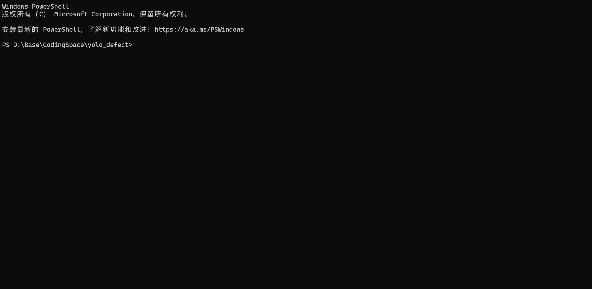

# Industrial Vision Edge AI Runtime and C++ Engineering System

[中文版](README_zh.md)

A C++17 inference system for industrial surface-defect detection, built with CMake, OpenCV and ONNX Runtime. The project combines model contracts, image processing, inference, bounded concurrency and performance analysis in a reusable Runtime library.

The current implementation supports FP32 and QDQ/U8S8 INT8 models, single-image detection, directory/manifest processing, Python/C++ consistency comparison, benchmarks and ORT profiling. It runs on Windows x86_64 and WSL2/Linux x86_64; the same source also cross-compiles to Linux AArch64 and runs under QEMU user-mode. QEMU execution demonstrates functional portability under emulation.



## Architecture

```text
RuntimeConfig + ModelArtifactSpec -> actual ModelMetadata
                                      |
Image -> OpenCV preprocess -> ONNX Runtime CPU -> owned output tensors
                                      |
                       YOLO decode -> NMS -> coordinate restore
                                      |
                      DetectionResult -> JSON / visualization
                                      |
Directory / manifest -> bounded queue -> worker-owned DetectorPipeline
                                      |
                        ordered per-image results + BatchSummary
```

`RuntimeConfig` selects the model declaration, provider and thresholds. `ModelArtifactSpec` describes the model and its tensor/processing semantics; `ModelMetadata` captures what the loaded model actually exposes. `DetectorPipeline` composes preprocessing, inference and postprocessing, while `BatchRunner` distributes images across workers, each with its own pipeline and ORT session.

The Runtime library contains the reusable behavior. The CLI handles arguments and file orchestration; platform support covers dependency discovery, shared-library loading, memory measurement and signal handling. Windows and Linux share the detection implementation.

## Modules

| Location | Purpose |
|---|---|
| [`cpp_infer/include`](cpp_infer/include/) / [`cpp_infer/src`](cpp_infer/src/) | C++ contracts, Runtime, batch execution and CLI |
| [`cpp_infer/configs`](cpp_infer/configs/) / [`cpp_infer/artifacts`](cpp_infer/artifacts/) | Runtime choices and model declarations |
| [`cpp_infer/tools`](cpp_infer/tools/) | Build/run workflows, consistency, quantization and result analysis |
| [`cpp_infer/tests`](cpp_infer/tests/) | C++ and Python tests, CLI checks and input fixtures |
| [`cpp_infer/protocols`](cpp_infer/protocols/) | Quantization and comparison experiment parameters |
| [`models`](models/) / `data/` | Model artifacts and local images/labels |
| [`scripts`](scripts/) / [`src`](src/) / [`api`](api/) | Python training, evaluation, inference and API utilities |

The supplied YOLOv8 model detects six NEU-DET classes: crazing, inclusion, patches, pitted surface, rolled-in scale and scratches. FP32 and INT8 selection uses configuration files; both expose the same float32 input/output contract to the Runtime.

## Quick Start

Run these commands from the repository root after configuring dependencies as described in the [C++ technical manual](cpp_infer/README.md).

### Windows

Copy the environment example to the ignored local configuration file and fill in your SDK and Python paths:

```powershell
Copy-Item cpp_infer/tools/stage1.local.example.psd1 cpp_infer/.stage1.local.psd1
.\cpp_infer\tools\stage1.cmd build
.\cpp_infer\tools\stage1.cmd detect data\images\val\crazing_241.jpg
.\cpp_infer\tools\stage1.cmd batch data\images\val -Workers 4 -QueueCapacity 8
```

`stage1.cmd` initializes the Visual Studio x64 environment. `detect` writes JSON and PNG by default; `batch` writes per-image JSON and a summary, with images enabled by `-OutputImages`.

### Linux / WSL2

```bash
export ONNXRUNTIME_ROOT=/path/to/onnxruntime-linux-x64-1.19.2
export YOLO_DEFECT_PYTHON=/path/to/python
export YOLO_DEFECT_GTEST_SOURCE=/usr/src/googletest
bash cpp_infer/tools/stage1.sh build
bash cpp_infer/tools/stage1.sh detect data/images/val/crazing_241.jpg
bash cpp_infer/tools/stage1.sh batch data/images/val --workers 4 --queue-capacity 8
```

Select INT8 with `-Config cpp_infer\configs\int8_u8s8_config.txt` on Windows or `--config cpp_infer/configs/int8_u8s8_config.txt` on Linux for `detect`, `batch` or `batch-compare`. The default configuration selects FP32.

## Tool Workflows

| Action | Behavior |
|---|---|
| `help` / `doctor` | Show usage / inspect the build environment |
| `build` / `clean-build` | Incremental build / recreate the build tree |
| `test` | Build and run CTest |
| `detect` / `demo` | Process a chosen image / run the fixed demo |
| `batch` | Process a directory or UTF-8 path-list manifest with bounded workers |
| `batch-compare` | Compare workers 1 and 4 on the fixed image set, with queue capacity 8 |
| `consistency` | Compare Python ORT and C++ ORT detections |
| `benchmark` | Run a standalone benchmark; default warmup 10, repeat 100 |
| `all` | Incremental build, full CTest, benchmark and batch |

Windows also offers a `profile` action. The C++ CLI exposes `--profile` on both platforms. Profiling provides operator/node/provider timings from an instrumented ORT session; benchmark uses a separate unprofiled session.

AArch64 cross-compilation and QEMU execution use `bootstrap_aarch64_deps.sh` and `stage2_aarch64.sh`, with setup and commands in the [technical manual](cpp_infer/README.md#aarch64-交叉编译与-qemu).

## Documentation

- [C++ technical manual](cpp_infer/README.md): dependencies, configuration, CLI, output formats, timing and analysis tools.
- [Runtime configuration](cpp_infer/configs/default_config.txt) and [model declaration](cpp_infer/artifacts/yolov8_neu_det.artifact.txt): executable configuration examples.
- [Historical archive](docs/archive/): previous documentation and experiment narratives.
