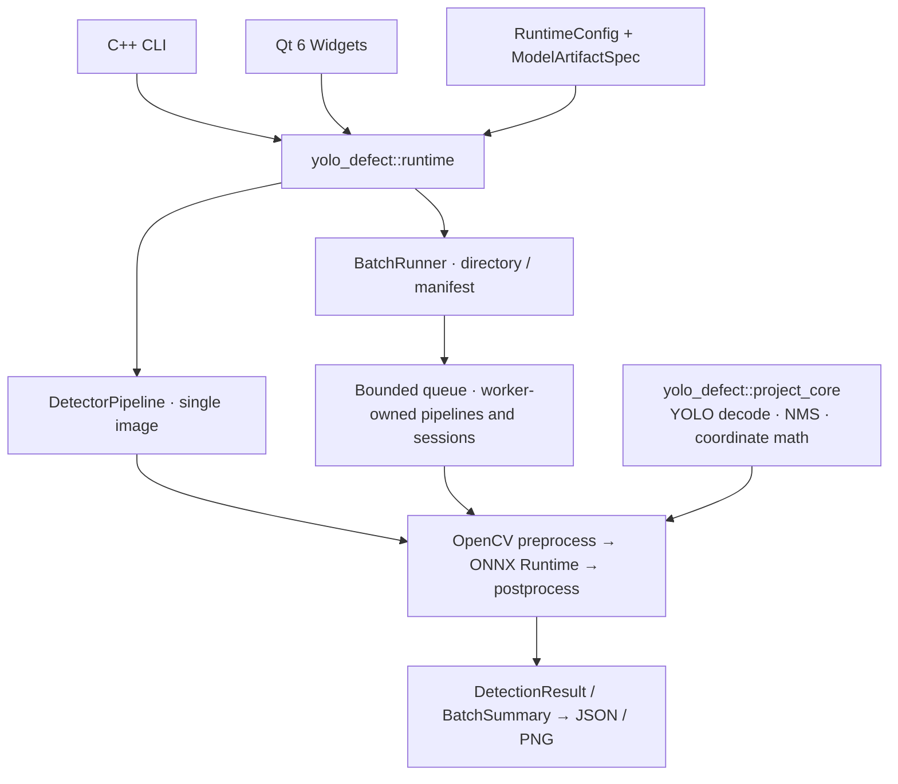

# Industrial Vision Edge AI Runtime and C++ Engineering System

[中文版](README_zh.md)

A C++17 system for industrial surface-defect detection, with a Qt desktop workbench and a reusable inference Runtime. Built with CMake, OpenCV and ONNX Runtime, it covers model contracts, FP32/INT8 inference, bounded batch processing, correctness checks and performance analysis.

**[Visual demo](https://LiuSiChengGitHub.github.io/yolo_defect/demo/index.en.html)**


**See the workflow in motion**

Select six sample images → run a batch → browse successful results → inspect linked boxes and table rows.


## What the project demonstrates

| Area | Implemented behavior |
|---|---|
| Desktop application | Qt 6 Widgets; warm dark interface with one palette driving the QSS theme and custom-painted canvases; single-image, directory and manifest input; responsive background execution; cooperative stop; per-image failures; zoom, pan and linked box/table selection |
| Inference Runtime | Configuration and model-contract validation; OpenCV preprocessing; ONNX Runtime CPU inference; YOLO decode, NMS and coordinate restoration; JSON/PNG output |
| Bounded concurrency | A bounded task queue, one pipeline/session per worker, deterministic result ordering, partial-failure isolation and final batch summaries |
| Validation and analysis | Python/C++ and GUI/CLI comparison, FP32/QDQ U8S8 INT8 workflows, standalone benchmark, ORT profiling and batch-run comparison |
| Portability | Runtime validated on Windows x86_64 and WSL2/Linux x86_64; Linux AArch64 cross-build and functional execution under QEMU. Qt GUI validation currently targets Windows x64 |

The supplied YOLOv8 model detects six NEU-DET classes: crazing, inclusion, patches, pitted surface, rolled-in scale and scratches. FP32 and INT8 are selected through configuration; both retain a float32 external input/output contract.

## Architecture


```mermaid
flowchart TD
    CLI[C++ CLI] --> Runtime
    Qt[Qt 6 Widgets] --> Runtime
    Config[RuntimeConfig + ModelArtifactSpec] --> Runtime[yolo_defect::runtime]
    Runtime --> Single[DetectorPipeline · single image]
    Runtime --> Batch[BatchRunner · directory / manifest]
    Batch --> Workers[Bounded queue · worker-owned pipelines and sessions]
    Single --> Inference[OpenCV preprocess → ONNX Runtime → postprocess]
    Workers --> Inference
    Core[yolo_defect::project_core<br/>YOLO decode · NMS · coordinate math] --> Inference
    Inference --> Output[DetectionResult / BatchSummary → JSON / PNG]
```

`RuntimeConfig` selects the model declaration, provider and thresholds. `ModelArtifactSpec` declares tensor and processing semantics; `ModelMetadata` records what the loaded model exposes. `DetectorPipeline` composes one detection, while each `BatchRunner` worker owns its pipeline and ORT session.

Qt and CLI call the same Runtime directly. Qt background workers adapt synchronous calls to signals and value results; the GUI requests cooperative stop through the Runner's thread-safe interface. Batch scheduling remains inside the Runtime. Result previews read saved JSON/images without repeating inference, and widgets remain on the GUI thread.

Qt is an optional CMake target (`YOLO_DEFECT_BUILD_QT=OFF` by default). The Runtime, CLI and dependency-free core build without Qt. Layout, the palette and QSS theme, SVG icons and image interaction stay in the desktop module, so visual changes never touch inference code.

## Run the project

### Windows desktop workbench

**Ways to launch**

| Method | When to use | How |
|---|---|---|
| Double-click the package | Demos and hand-off; the target machine needs no Qt, compiler or Python | Open the packaged directory (for example `dist/yolo-defect-qt/`) and double-click `run.cmd` |
| Double-click the source launcher | A configured development machine, without using a terminal | Double-click `start_qt_workbench.cmd` in the repository root; it builds the client once if it has not been built yet |
| Command line | Development and debugging, or a specific configuration and input | `.\cpp_infer\tools\qt.cmd run`, optionally with `-Config`, `-Image` and `-OutputDir` |

Every method preselects the FP32 configuration and sample image. Choose **Run detection**, or switch the input mode to a directory or manifest for batch processing. The GUI shows a busy state while running and final counts when complete; it does not estimate a percentage. Each run saves its own result directory: under `results/qt/` for the source methods and under `outputs/` inside the package. Double-click launches also open a console window that closes with the workbench and keeps any startup error visible. The `yolo_defect_qt.exe` in the build directory cannot be double-clicked directly, because these entry points set the Qt and OpenCV runtime paths it needs.

**First-time setup for the source methods**

Use an x64 MSVC toolchain, **Qt 6.2+ MSVC x64** SDK, OpenCV 4 and ONNX Runtime C++ SDK 1.19.2. The validated desktop build uses Qt 6.8.3. Dependency setup and path options are in the [Qt client guide](cpp_infer/apps/qt/README.md#windows-x64-构建与启动).

From the repository root, create the ignored local settings files **once** and fill in your installed SDK paths. Then double-click `start_qt_workbench.cmd`, or build and launch from a terminal:

```powershell
Copy-Item cpp_infer/tools/stage1.local.example.psd1 cpp_infer/.stage1.local.psd1
Copy-Item cpp_infer/tools/qt.local.example.psd1 cpp_infer/.qt.local.psd1
.\cpp_infer\tools\qt.cmd build
.\cpp_infer\tools\qt.cmd run
```

The double-click launcher builds only when the client is missing. After changing source code, run `qt.cmd build` once, then double-click or use `run`.

**Build a double-click package**

To assemble a relocatable Windows demo directory from the configured development environment:

```powershell
.\cpp_infer\tools\qt.cmd package
```

The default output is `dist/yolo-defect-qt/`; `-PackageDir <new-empty-directory>` selects another destination. Copy the whole directory to another Windows x64 machine, double-click `run.cmd` to launch, and open its `demo/index.en.html` for instructions; the bundled `verify.ps1` checks dependencies and runs real detections. The [offline guide](docs/demo/index.en.html) describes bundled files, dependencies and demonstration steps.

### CLI on Windows / Linux

The CLI provides detection and analysis independently of the desktop. Configure dependencies using the [technical manual](cpp_infer/README.md#构建与依赖), then run from the repository root.

<details>
<summary>Windows CLI commands</summary>

```powershell
.\cpp_infer\tools\stage1.cmd build
.\cpp_infer\tools\stage1.cmd detect data\images\val\crazing_241.jpg
.\cpp_infer\tools\stage1.cmd batch data\images\val -Workers 4 -QueueCapacity 8
```

`stage1.cmd` initializes the Visual Studio x64 environment and reads `cpp_infer/.stage1.local.psd1`.

</details>

<details>
<summary>Linux / WSL2 CLI commands</summary>

```bash
export ONNXRUNTIME_ROOT=/path/to/onnxruntime-linux-x64-1.19.2
export YOLO_DEFECT_PYTHON=/path/to/python
export YOLO_DEFECT_GTEST_SOURCE=/usr/src/googletest
bash cpp_infer/tools/stage1.sh build
bash cpp_infer/tools/stage1.sh detect data/images/val/crazing_241.jpg
bash cpp_infer/tools/stage1.sh batch data/images/val --workers 4 --queue-capacity 8
```

</details>

CLI `detect` writes JSON and PNG by default. CLI `batch` writes per-image JSON and a summary; add `-OutputImages` on Windows or `--output-images` on Linux to save visualizations.

**Models and samples:** the repository tracks `models/best.onnx` and the sample images, including `data/images/val/crazing_241.jpg`, so the default FP32 demo needs no separate model download. U8S8 INT8 is a reproducible local artifact, not a tracked model binary; see [model and sample setup](cpp_infer/README.md#模型与样例获取). Once generated, select `cpp_infer/configs/int8_u8s8_config.txt` in Qt or pass `-Config` / `--config` to the CLI wrappers.

## Repository map

| Location | Responsibility |
|---|---|
| [`cpp_infer/apps/qt`](cpp_infer/apps/qt/) | Desktop widgets, table models, image interaction and background adapters |
| [`cpp_infer/include`](cpp_infer/include/) / [`cpp_infer/src`](cpp_infer/src/) | Public contracts, project core, inference Runtime, batch execution and CLI |
| [`cpp_infer/configs`](cpp_infer/configs/) / [`cpp_infer/artifacts`](cpp_infer/artifacts/) | Runtime choices and model declarations |
| [`cpp_infer/tools`](cpp_infer/tools/) | Build/run/package entry points, quantization, consistency and result analysis |
| [`cpp_infer/tests`](cpp_infer/tests/) / [`cpp_infer/protocols`](cpp_infer/protocols/) | Unit/integration tests, input fixtures and reproducible experiment protocols |
| [`models`](models/) / [`data`](data/) | Tracked FP32 model, image/label data and local derived model artifacts |
| [`scripts`](scripts/) / [`src`](src/) / [`api`](api/) | Python training, evaluation, inference and API utilities |
| [`docs/demo`](docs/demo/) / [`docs/assets/qt`](docs/assets/qt/) | Offline demonstration guide and replaceable presentation media |

Build products, local SDK paths, demo packages and generated result directories are ignored by Git. The desktop module has no runtime dependency on `tmp/`.

## Validation and performance workflows

```powershell
.\cpp_infer\tools\qt.cmd test -Screenshots
.\cpp_infer\tools\stage1.cmd test
.\cpp_infer\tools\stage1.cmd consistency
.\cpp_infer\tools\stage1.cmd benchmark -Warmup 10 -Repeat 100
.\cpp_infer\tools\stage1.cmd batch-compare
```

Qt integration checks compare FP32/U8S8 results with the CLI and exercise corrupt images, input ordering, UI responsiveness, stopping/restarting, closing during work and selection/zoom behavior. Native Windows checks also cover 200% scaling and compact layouts. Current environment and acceptance records are in the [Qt guide](cpp_infer/apps/qt/README.md).

The CLI workflows also provide `doctor`, `demo`, `clean-build` and `all`. Windows offers a `profile` wrapper; both platforms expose `--profile` in the C++ CLI. See the [benchmark/profiling manual](cpp_infer/README.md#benchmarkprofiling-与结果分析) for commands and timing definitions.

Benchmark uses a separate unprofiled CPU session, excludes warmup and reports stage timings, P50/P95 and throughput. Batch throughput is successful images divided by processing wall time. GUI task duration includes setup and writing, so it is not a benchmark substitute. QEMU results establish functionality under emulation, not native ARM performance; [AArch64 instructions](cpp_infer/README.md#aarch64-交叉编译与-qemu) describe that workflow.

## Documentation

| Read this | For |
|---|---|
| [Visual demo guide](docs/demo/index.en.html) | Demonstration directory, launch/use instructions and media updates |
| [Qt client engineering guide](cpp_infer/apps/qt/README.md) | Setup, interaction, thread ownership, lifecycle, tests and UI maintenance |
| [C++ Runtime manual](cpp_infer/README.md) | Dependencies, model setup, configuration, CLI, output schemas and analysis |
| [Default configuration](cpp_infer/configs/default_config.txt) / [model declaration](cpp_infer/artifacts/yolov8_neu_det.artifact.txt) | Concrete Runtime and model-contract examples |

Project code is covered by [LICENSE](LICENSE). Model provenance and artifact licensing are recorded separately in the [model declaration](cpp_infer/artifacts/yolov8_neu_det.artifact.txt).
