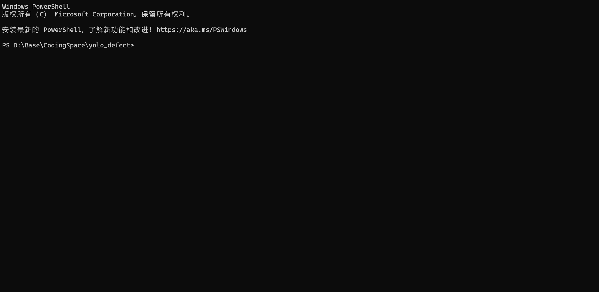
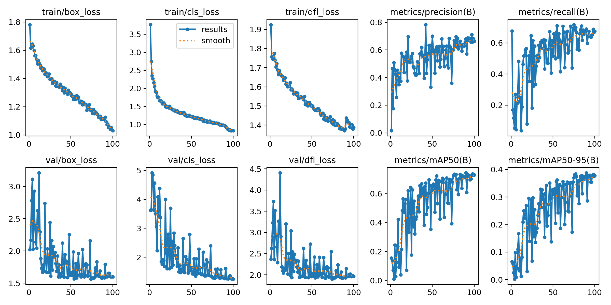
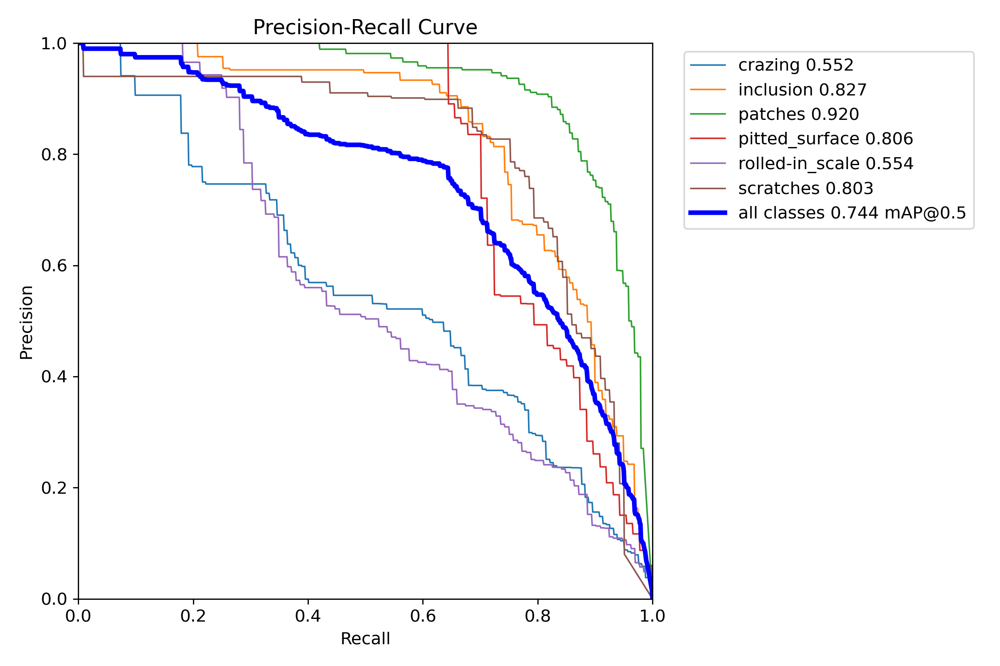
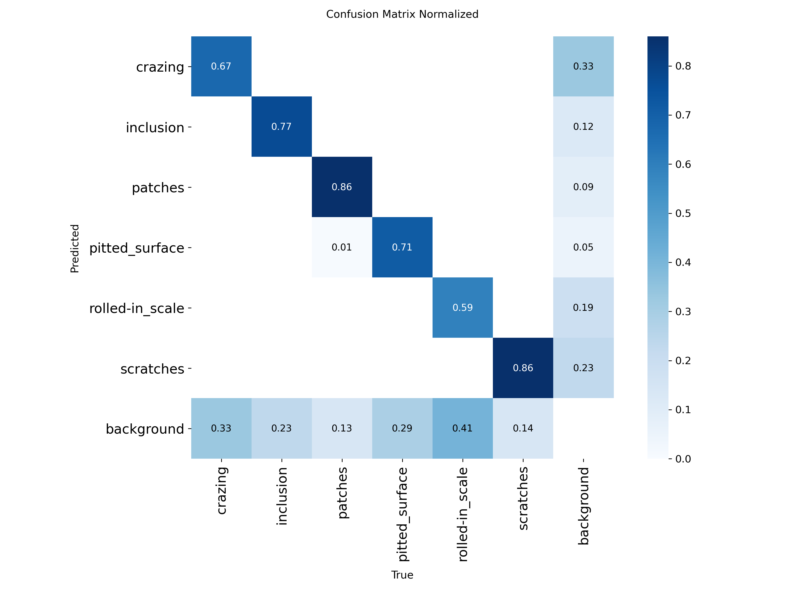
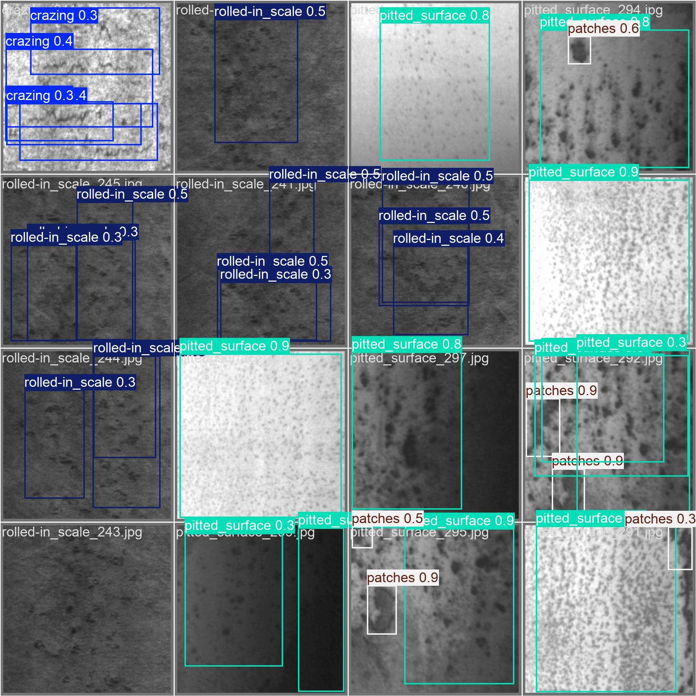

# 工业视觉 AI 推理 Runtime — 钢材表面缺陷检测


V2 定位：本仓库正在从“YOLOv8 缺陷检测 demo”升级为“工业视觉 AI 推理 Runtime 与 C++ 工程化系统”。

YOLOv8 和 NEU-DET 是模型与数据集载体。秋招主线不是“我训练了一个检测模型”，而是“我把视觉模型通过 C++ / ONNX Runtime C++ / OpenCV / CMake / GTest / benchmark 变成可部署、可测试、可评测、可解释的工程化 Runtime”。

当前 V1 资产仍然保留价值：训练、ONNX 导出、PyTorch-vs-ONNX 一致性验证、Python ONNX Runtime 推理、FastAPI、Docker 和 benchmark 脚本。V2 在这些资产之上通过 `cpp_infer/` 推进，而不是重写旧代码。

项目入口刻意集中在本 README 和 `README_zh.md`。`AGENTS.md` 只记录 Codex 协作边界；任务队列和变更记录放在 README 中，方便秋招前统一复盘。



## 项目1 Runtime 总入口蓝图

### 1. 项目定位和顶层设计

本仓库是**项目1：工业视觉边缘 AI Runtime 与 C++ 工程化系统**。它的核心价值不是在这个仓库里重新训练模型，而是把工业缺陷检测模型 artifact 变成可运行、可测试、可评测、可复盘、可面试讲清楚的 C++ Runtime。

项目1计划支持两类模型来源：

- **YOLOv8 + NEU-DET：** 稳定的 P0 Runtime baseline。它输出结构简单，仓库已有训练、ONNX 导出、Python 推理、FastAPI、Docker 和 benchmark 证据，适合先打通 C++ 部署主链路。
- **`paper_detect` D010 / D-FINE-S + DeepPCB：** 后续研究侧 artifact 来源。`paper_detect` 负责训练、验证、消融、official test、result card 和定性图；本仓库通过 artifact contract 消费这些产物，并在 artifact 稳定后尝试接入 Runtime。

顶层设计原则：**训练侧和研究侧产物进入项目1；项目1负责部署链路、Runtime 行为、测试、benchmark 证据和推理事件输出。**

### 2. 解决的问题

项目1解决的是“有一个检测模型”和“能把模型作为工程软件部署、测试、评测、讲清楚”之间的断层：

- 把图片和模型 artifact 变成可复现的 C++ 推理链路。
- 将 preprocess、inference、postprocess、NMS、benchmark、输出写入拆成可观察模块。
- 记录命令、样例输出、失败原因和取舍，让项目能服务秋招复盘与面试追问。
- 为项目2准备 `inference_event` 输出，让边缘推理结果能进入后端 incident 和 Agent 诊断链路。

### 3. 总体架构链路

计划完整链路：

```text
model artifact
-> artifact contract / model card
-> RuntimeConfig
-> OpenCV image read
-> letterbox preprocess / RGB / float32 / NCHW tensor
-> ONNX Runtime C++ session
-> raw output shape check
-> postprocess / score filter / NMS / coordinate restore
-> detection JSON
-> visualization
-> benchmark report
-> optional INT8 PTQ / TensorRT attempt
-> sample inference_event for Project 2
```

当前 P1-03 已验证链路：

```text
cpp_infer/configs/default_config.txt
-> RuntimeConfig
-> data/images/val/crazing_241.jpg
-> OpenCV BGR image
-> letterbox preprocess
-> RGB float32 NCHW tensor
-> stable CLI summary
-> CTest smoke
```

### 4. 核心模块职责

| 模块 | 职责 | 当前状态 |
|------|------|----------|
| `ConfigLoader` | 解析输入尺寸、类别名、阈值、NMS 阈值、backend 等 Runtime 配置。 | P1-02 已验证 |
| `ImagePreprocessor` | 用 OpenCV 读图、letterbox、BGR->RGB、normalize，并输出 NCHW float tensor。 | P1-03 已验证 |
| `OnnxRunner` | 加载 ONNX Runtime session，检查 input/output 名称与 shape，构造 tensor 并执行推理。 | P1-04 占位 |
| `PostProcessor` | 解析 raw output，做 score filter，把坐标还原回原图。 | P1-05 占位 |
| `NmsProcessor` | 提供可测试的 IoU / NMS 最小实现，也是后续代码练习候选模块。 | P1-05/P1-07 占位 |
| `ResultWriter / Visualizer` | 输出 detection JSON 和可视化图片，形成 demo 证据。 | 占位 |
| `BenchmarkRunner` | 统计 preprocess、infer、postprocess、end-to-end 的 warmup/repeat latency。 | P1-06 占位 |
| `ArtifactRegistry / ModelCard` | 记录 artifact 来源、模型族、数据集、指标、配置、后处理类型、runtime 状态和路径。 | D010 L1 占位 |
| `Tests` | 当前用 CTest smoke；后续补 GTest 覆盖 config、preprocess、NMS、postprocess、artifact schema。 | 目前 CTest，GTest 占位 |

### 5. 快速启动

当前 C++ Runtime smoke 路径：

```cmd
:: 在 Visual Studio 2026 Developer Command Prompt 中运行
set BUILD_DIR=%TEMP%\yolo_defect_cpp_p1_03
set PATH=D:\01_Base\Tools\opencv\build\x64\vc16\bin;%PATH%

cmake -S cpp_infer -B "%BUILD_DIR%" -G "NMake Makefiles" -DOpenCV_DIR=D:\01_Base\Tools\opencv\build\x64\vc16\lib
cmake --build "%BUILD_DIR%"

"%BUILD_DIR%\bin\yolo_defect_cpp.exe" --config cpp_infer\configs\default_config.txt --image data\images\val\crazing_241.jpg
ctest --test-dir "%BUILD_DIR%" --output-on-failure
```

下方旧 Python/YOLO 快速开始仍保留，用于复现 V1 baseline。上面的 C++ 命令是 V2 部署主入口。

### 6. Demo 输入输出

当前 demo 输入：

```text
config: cpp_infer/configs/default_config.txt
image:  data/images/val/crazing_241.jpg
```

当前 P1-03 demo 输出摘要：

```text
P1-03 Preprocess summary
original_size: 200x200
channels: 3
input_size: 800x800
resized_size: 800x800
scale: 4.000000
padding: left=0, top=0, right=0, bottom=0
color: BGR->RGB
normalization: float32 [0, 1]
layout: NCHW
tensor_shape: 1x3x800x800
tensor_elements: 1920000
```

后续 demo 输出占位：

```text
detection_json: samples/outputs/crazing_241_detections.json
visualization:   samples/outputs/crazing_241_vis.jpg
benchmark_json:  samples/outputs/benchmark_yolo_fp32.json
event_json:      samples/outputs/inference_event_sample.json
```

### 7. 测试命令

当前 CTest smoke：

```cmd
ctest --test-dir "%BUILD_DIR%" --output-on-failure
```

当前预期结果：

```text
100% tests passed, 0 tests failed out of 3
```

后续 GTest 占位：

```cmd
"%BUILD_DIR%\bin\yolo_defect_cpp_tests.exe" --gtest_filter=*
```

### 8. 关键数据与产物结果

| 项 | 当前记录 |
|----|----------|
| P0 数据集 | NEU-DET 钢材表面缺陷，1,800 张图，6 类，200x200 像素 |
| P0 模型 | YOLOv8n baseline 与调参版本 |
| 当前最佳 YOLO 结果 | `final_train_2`，mAP@0.5 = 0.743，mAP@50-95 = 0.388 |
| ONNX/PyTorch 对齐 | 50/50 张图检测框数量完全一致；总检测数 146 vs 146 |
| 既有 ONNX benchmark | ONNX CPU 24.4 FPS，ONNX GPU 72.1 FPS（RTX 3060） |
| 当前 C++ Runtime 状态 | P1-03 config + OpenCV preprocess + CTest smoke 已验证 |
| 后续研究侧 artifact | `paper_detect` D010，D-FINE-S 架构，DeepPCB 数据集 |
| 路线中记录的 D010 结果 | formal validation AP50-95 = 0.847057；official test AP50-95 = 0.830385 |
| D010 关系 | D010 是 proposed artifact；D003 是 reference/ancestor；D010 在 formal 和 official-test 的 6 类 delta 全部优于 D003 |
| D010 接入层级 | L0 result card，L1 model artifact contract，L2 ONNX/runtime adapter 只在 artifact 稳定后推进 |

待补 artifact 路径：

```text
artifacts/paper_detect_d010/result_card.md        # placeholder
artifacts/paper_detect_d010/model_artifact.yaml   # placeholder
artifacts/paper_detect_d010/metrics_table.csv     # placeholder
artifacts/paper_detect_d010/qualitative/          # placeholder
```

### 9. 关键设计取舍

- **Runtime 优先，训练其次：** 保留旧训练资产，但 V2 主线不是继续包装训练。
- **先 YOLO baseline，再 D010 adapter：** YOLO/ONNX 是最快完成 C++ preprocess、infer、postprocess、JSON、benchmark、测试的稳定路线。
- **D010 分层接入：** D010 先作为 artifact 证据进入 README 和 model card；D-FINE C++ 后处理不阻塞 Runtime baseline。
- **简单 C++ 工程优先：** C++17、CMake、OpenCV、ONNX Runtime C++、GTest、benchmark 输出已经足够匹配秋招目标。
- **先 smoke test，再补 GTest：** 每个小阶段先保证能跑通；当 NMS、postprocess、artifact schema 稳定后再深测。
- **失败也要记录：** TensorRT、INT8、D-FINE runtime 即使失败，只要命令、错误、原因、回退路径记录清楚，也能成为工程取舍证据。

### 10. 任务队列

详细 P1 队列维护在下方“路线图”部分。按大阶段看：

| 阶段 | 目标 | 项目1重点 |
|------|------|-----------|
| 阶段0：口径冻结 | 对齐 README 和工程入口 | 把项目1定位为 C++ 边缘 Runtime；记录 paper_detect D010 artifact 接入路线 |
| 阶段1：C++ Runtime P0 | 让模型在 C++ 中跑起来 | Config、preprocess、ONNX Runtime、postprocess/NMS、JSON、可视化、benchmark |
| 阶段2：部署评测加固 | 增加工程证据 | benchmark protocol、GTest、错误处理、INT8 PTQ 尝试 |
| 阶段3：paper_detect artifact adapter | 补研究侧 artifact 可信度 | D010 result card、model_artifact contract、可选 D-FINE runtime adapter |
| 阶段4：云边端协同 | 连接项目1和项目2 | sample inference_event JSON |
| 阶段5：秋招版本冻结 | 停止新增大功能 | README、demo、测试、报告、FAQ、面试讲解稿 |

### 11. 版本变化与进度记录

当前状态：P1-00 到 P1-03 已完成并验证。除非用户明确要求先做文档或 artifact contract，下一步实现阶段仍然是 P1-04 ONNX Runtime session smoke。

时间线式 V2 入口记录维护在下方“路线图”部分，每完成一个小阶段必须更新。

### 12. 从项目起点到现在的教学式记录

| 阶段 | 做了什么 | 目的 | 实现方式 / 证据 | 问题与排查经验 |
|------|----------|------|-----------------|----------------|
| P1-00 | 冻结 V2 定位，保护旧资产，建立 `cpp_infer/` 入口。 | 防止项目在训练 demo 和 Runtime 工程之间跑偏。 | README/README_zh/AGENTS 与 C++ 工作区骨架。 | README 要作为主线入口，不要把任务拆成很多碎片文档。 |
| P1-01 | 新增最小 C++17/CMake 可执行文件和 CTest help smoke。 | 证明仓库可以构建 C++ Runtime target。 | `yolo_defect_cpp --help` 和 CTest smoke。 | Visual Studio 多配置构建需要 `ctest -C Debug`。 |
| P1-02 | 新增无第三方依赖 ConfigLoader 和 `--config` CLI。 | 在接图像和模型前，先让 Runtime 行为配置化。 | 解析输入尺寸、类别、阈值、backend 并打印稳定摘要。 | CLI 参数错误成为第一类可用 smoke-test 失败信号。 |
| P1-03 | 新增 OpenCV 读图和 YOLO 风格 preprocess。 | 把真实图片转换成模型可吃的 tensor 格式。 | 打印 `original_size`、`scale`、`padding`、`BGR->RGB`、`[0,1]`、`NCHW`、`1x3x800x800`；CTest 3/3 通过。 | OpenCV Windows pack 需要 `OpenCV_DIR=...\x64\vc16\lib`，运行时还要把 `...\x64\vc16\bin` 放进 `PATH`。 |

## 项目亮点

- **当前最佳实验结果** — 当前最佳模型 `final_train_2` 达到 **mAP@0.5 = 0.743**
- **PyTorch / ONNX 一致性抽查** — 50 张图全部检测框数量完全一致（**50/50**），总检测框数 **146 vs 146**
- **推理速度基准测试** — PyTorch CPU **8.43 FPS**；PyTorch GPU（RTX 3060）**110.8 FPS**；ONNX CPU **24.4 FPS**；ONNX GPU（RTX 3060）**72.1 FPS**，均在 100 张计时图片（5 张预热）上测量
- **Docker 已验证** — `python:3.9-slim` 镜像已成功跑通 `/health` 和 `/detect`
- **克隆即用** — 数据集（28MB）已包含在仓库内，无需额外下载

## 关键指标

| 指标 | 当前结果 |
|------|----------|
| 最佳模型 | `final_train_2` |
| mAP@0.5 | **0.743** |
| mAP@50-95 | **0.388** |
| PT/ONNX 检测框数一致率 | **50 / 50**（**100%**） |
| 平均检测框数差值 | **0.000** |
| PyTorch CPU 基准测试 | **8.43 FPS** / **118.66 ms** 每张 |
| PyTorch GPU 基准测试（RTX 3060） | **110.8 FPS** / **9.0 ms** 每张 |
| ONNX CPU 基准测试 | **24.4 FPS** / **40.9 ms** 每张 |
| ONNX GPU 基准测试（RTX 3060） | **72.1 FPS** / **13.9 ms** 每张 |
| 模型大小（`best.pt` / `best.onnx`） | ~6.0 MiB / ~11.8 MiB |

## V1 Python Baseline 快速开始

```bash
# 克隆（数据集已包含，约 28MB）
git clone https://github.com/LiuSiChengGitHub/yolo_defect.git
cd yolo_defect

# 安装依赖
conda env create -f environment.yml
conda activate yolo_defect

# 数据准备（VOC XML -> YOLO TXT）
python scripts/prepare_data.py

# 训练
python scripts/train.py

# 从默认训练输出导出 ONNX
python scripts/export_onnx.py --weights runs/detect/train/weights/best.pt

# 用真实验证集样例做推理
python scripts/inference_onnx.py --model models/best.onnx --image data/images/val/crazing_241.jpg
```

## 数据集

### NEU-DET：东北大学钢材表面缺陷数据库

**来源：** [NEU Surface Defect Database](http://faculty.neu.edu.cn/songkechen/zh_CN/zdylm/263270/list/)

NEU-DET 数据集由东北大学宋克臣教授团队发布，包含 1,800 张热轧钢带表面灰度图像，是工业缺陷检测领域最常用的公开基准数据集之一。涵盖 6 类典型表面缺陷：

| 类别 ID | 英文名 | 中文名 | 描述 | 检测难度 |
|---------|--------|--------|------|----------|
| 0 | crazing | 龟裂 | 表面细密裂纹网络 | 高（纹理细密，与背景区分度低） |
| 1 | inclusion | 夹杂 | 钢材内嵌入的异物 | 中 |
| 2 | patches | 斑块 | 不规则变色区域 | 中 |
| 3 | pitted_surface | 麻面 | 表面分布的小凹坑 | 中 |
| 4 | rolled-in_scale | 压入氧化铁皮 | 轧制过程中压入表面的氧化皮 | 中 |
| 5 | scratches | 划痕 | 机械接触产生的线性痕迹 | 低（线性特征明显） |

### 数据统计

- **论文 / 官方描述中的总数：** 1,800（每类 300 张）
- **`data/NEU-DET/` 中实际可读取的 JPG 数：** 1,800
- **图片尺寸：** 200 x 200 像素
- **格式：** JPG（标注中标记为 depth=1 灰度，但实际可以作为 3 通道 BGR 读取）
- **`data/images/` 中已生成的 YOLO 图片划分：** 训练集 1,439 张，验证集 361 张
- **数据集已包含在 `data/NEU-DET/` 目录中**

### 原始数据目录结构

```
data/NEU-DET/
├── train/                         # 训练集（可读取图片 1,439 张）
│   ├── annotations/               # VOC XML 标注（扁平目录，所有类混在一起）
│   │   ├── crazing_1.xml          #   文件名格式：{类名}_{编号}.xml
│   │   ├── inclusion_1.xml
│   │   ├── rolled-in_scale_1.xml  #   注意：类名含连字符！
│   │   └── ...
│   └── images/                    # JPG 图片（按类名分子目录）
│       ├── crazing/               #   文件名格式：{类名}/{类名}_{编号}.jpg
│       │   ├── crazing_1.jpg
│       │   └── ...
│       ├── inclusion/
│       ├── patches/
│       ├── pitted_surface/
│       ├── rolled-in_scale/
│       └── scratches/
└── validation/                    # 验证集（XML 361 个，可读取图片 361 张），结构同 train
    ├── annotations/
    └── images/
```

> **注意设计上的不对称：** annotations 是扁平目录（所有类的 XML 混在一起），而 images 按类名分子目录。这种不对称在数据准备脚本中需要特殊处理。

### 标注格式说明

原始数据使用 **VOC XML** 格式（源自 Pascal VOC 目标检测挑战赛）。每张图对应一个 XML 文件：

```xml
<annotation>
    <size>
        <width>200</width>            <!-- 图片宽度 -->
        <height>200</height>           <!-- 图片高度 -->
        <depth>1</depth>               <!-- 通道数（灰度=1） -->
    </size>
    <object>                           <!-- 一个标注目标（可以有多个 object） -->
        <name>crazing</name>           <!-- 类别名称 -->
        <bndbox>
            <xmin>2</xmin>             <!-- 左上角 x 坐标（像素） -->
            <ymin>2</ymin>             <!-- 左上角 y 坐标（像素） -->
            <xmax>193</xmax>           <!-- 右下角 x 坐标（像素） -->
            <ymax>194</ymax>           <!-- 右下角 y 坐标（像素） -->
        </bndbox>
    </object>
    <!-- 一张图可能有多个 <object>，如 rolled-in_scale 常有 2-3 个 bbox -->
</annotation>
```

> **格式说明：** VOC 格式用绝对像素坐标的角点表示 (xmin, ymin, xmax, ymax)，而 YOLO 格式用归一化的中心点+宽高 (cx, cy, w, h)。这是从标注文件转换到训练输入时最核心的差异。

## 数据准备

### 转换说明

`prepare_data.py` 将 VOC XML 标注转换为 YOLO TXT 格式（Ultralytics YOLOv8 要求的输入格式）。

**VOC 格式**（绝对像素坐标，角点表示）：
```
xmin, ymin, xmax, ymax  →  例如: 2, 2, 193, 194
```

**YOLO 格式**（归一化中心坐标）：
```
class_id cx cy w h  →  例如: 0 0.487500 0.490000 0.955000 0.960000
```

**归一化转换公式：**
```
cx = (xmin + xmax) / 2 / image_width    # 中心点 x，归一化到 0-1
cy = (ymin + ymax) / 2 / image_height   # 中心点 y，归一化到 0-1
w  = (xmax - xmin) / image_width        # 宽度，归一化到 0-1
h  = (ymax - ymin) / image_height       # 高度，归一化到 0-1
```

> **为什么要归一化？** 归一化后坐标与图片分辨率无关。训练时 YOLO 会把 200x200 的原图 resize 到 640x640，归一化坐标会自动适配，不用手动调整标签值。

### 类别映射

| 类别名称 | 类别 ID | 说明 |
|----------|---------|------|
| crazing | 0 | 顺序固定，与 data.yaml 中的 names 对应 |
| inclusion | 1 | |
| patches | 2 | |
| pitted_surface | 3 | |
| rolled-in_scale | 4 | 注意：名字含连字符，不能用下划线分割提取类名 |
| scratches | 5 | |

### 运行

```bash
python scripts/prepare_data.py
# 或指定自定义路径：
python scripts/prepare_data.py --data-root data/NEU-DET --output-dir data
```

### 输出目录结构

```
data/
├── images/
│   ├── train/          # 扁平目录，所有训练图片（从子目录复制过来）
│   └── val/            # 扁平目录，所有验证图片
├── labels/
│   ├── train/          # YOLO TXT 标签（每张图一个 .txt，与图片同名）
│   └── val/
└── data.yaml           # YOLO 数据集配置文件
```

> **YOLO 对目录的要求：** `images/` 和 `labels/` 必须平级，且文件一一对应（`crazing_1.jpg` ↔ `crazing_1.txt`）。所以必须把按类名分的图片"拍平"到一个目录里。

### 踩坑注意事项

- 数据集**已经预划分**好训练集/验证集，不需要也不应该自己做随机划分
- `rolled-in_scale` 类名包含连字符 `-`，如果用 `filename.split('_')[0]` 提取类名会得到 `rolled-in`（错误！）。正确做法是用已知类名列表做前缀匹配，按长度从长到短排序确保最长匹配优先
- 图片必须从按类名分的子目录复制到扁平输出目录（YOLO 格式的硬性要求）
- 如果你手动更新了原始数据集，请重新执行 `prepare_data.py`，让 `data/images/` 和 `data/labels/` 与 `data/NEU-DET/` 保持一致

## 数据分析

对转换后的数据集运行 `data_analysis.py` 可得出以下结论：6 个类别整体上仍然分布均衡，无需过采样或类别加权。所有图片均为 200×200 px。每张图的 bbox 数量在 1 至 9 个之间（均值 2.33），目标密度适中。Bbox 尺寸差异极大——从 8×9 px 的细长划痕到近 199×199 px 的大面积裂纹——是一个多尺度检测的挑战性场景。YOLOv8 的 anchor-free 设计无需手动设置 anchor，天然适合处理这种宽泛的尺寸分布。分析图表已保存至 `docs/assets/`。

```bash
python scripts/data_analysis.py
```

## 训练

### 运行训练

```bash
# 方式一：通过 YAML 配置文件（推荐，实验可追溯）
python scripts/train.py --config configs/train_config.yaml

# 方式二：通过 Ultralytics CLI（快速实验）
yolo detect train data=data/data.yaml model=yolov8n.pt epochs=50 imgsz=640
```

### 超参数详解

| 参数 | 默认值 | 说明 |
|------|--------|------|
| `model` | `yolov8n.pt` | 模型变体。`n`=nano（最快），`s`/`m`/`l`/`x` 依次增大 |
| `data` | `data/data.yaml` | 数据集配置文件，定义路径和类名 |
| `epochs` | 50 | 总训练轮数。太少欠拟合，太多过拟合 |
| `imgsz` | 640 | 输入图片尺寸。原图 200x200 会被 resize 到 640x640 |
| `batch` | 16 | 批大小。更大 = 梯度更稳定，但需要更多显存 |
| `lr0` | 0.01 | 初始学习率。训练过程中会按 schedule 自动衰减 |
| `optimizer` | `auto` | 优化器。auto 会根据模型自动选择 SGD 或 AdamW |
| `mosaic` | 1.0 | Mosaic 数据增强概率。4 张图拼成 1 张 |
| `mixup` | 0.0 | Mixup 数据增强概率。两张图按比例混合 |
| `device` | 0 | CUDA 设备编号。`cpu` 则用 CPU 训练 |
| `workers` | 8 | 数据加载的工作进程数 |

### 训练流程详解

1. **加载预训练权重（迁移学习）**
   - YOLOv8n 使用在 COCO 数据集（80 类、33 万张图）上预训练的权重
   - 骨干网络（Backbone）已经学会了通用的特征提取能力（边缘、纹理、形状等）
   - 我们只需要在 NEU-DET 上微调（Fine-tune），让模型学习钢材缺陷的特定特征

2. **数据增强（在线增强，不额外占磁盘）**
   - **Mosaic**：把 4 张图拼成一张，每张占一个象限。好处是一次看到更多目标，提升小目标检测
   - **Mixup**：两张图按随机比例混合叠加，起正则化效果
   - **随机翻转**：水平/垂直翻转，增加数据多样性
   - **HSV 调整**：随机调整色相、饱和度、亮度，增强对光照变化的鲁棒性
   - **尺度抖动**：随机缩放输入图片，让模型适应不同大小的目标

3. **多尺度训练**
   - 训练时随机调整输入尺寸（如 480-640-800），让模型在不同分辨率下都能检测
   - 推理时固定为设定的 imgsz

4. **自动保存检查点**
   - `best.pt`：验证集上 mAP 最高的那个 epoch 的权重（用于最终评估和部署）
   - `last.pt`：最后一个 epoch 的权重（用于断点续训）
   - 保存路径：`runs/detect/train/weights/`

## 实验结果

### 实验对比

| 实验 | 模型 | imgsz | lr0 | epochs | mAP@0.5 | mAP@50-95 | 训练时间 | 备注 |
|------|------|-------|-----|--------|---------|-----------|----------|------|
| baseline | yolov8n | 640 | 0.01 | 50 | **0.734** | 0.390 | 9.4 分钟 | 默认配置，已超过 0.70 目标 |
| exp1 | yolov8n | 512 | 0.01* | 50 | 0.733 | 0.391 | 7.2 分钟 | 更快，但 hardest classes 明显下降 |
| exp2 | yolov8n | 800 | 0.01* | 50 | 0.742 | 0.385 | 13.4 分钟 | `optimizer=auto` 家族里最好的图片尺寸结果 |
| exp3_lr01 | yolov8n (SGD) | 640 | 0.01 | 50 | 0.736 | **0.395** | 9.0 分钟 | 固定 SGD 后最好的严格指标结果 |
| exp4 | yolov8n | 800 | 0.01* | 50 | 0.741 | 0.384 | 13.6 分钟 | `mixup=0.1` 没有带来提升 |
| exp5 | yolov8n | 800 | 0.01* | 50 | 0.740 | 0.387 | 13.3 分钟 | 去样本混合增强对照组 |
| final_train | yolov8n | 800 | 0.01* | 100 | 0.729 | 0.379 | 26.1 分钟 | 单纯拉长训练并没有变更优 |
| final_train_2 | yolov8n (SGD) | 800 | 0.01 | 100 | **0.743** | 0.388 | 25.9 分钟 | 手动组合最优候选后的当前最佳 `mAP@0.5` |

\* 本次训练中 `optimizer=auto` 自动选择了 `AdamW(lr=0.001)`，所以 `lr0=0.01` 不是实际生效学习率。

### 当前模型候选

- **`final_train_2`**：如果主打 `mAP@0.5`，这是当前最适合作为部署主模型的 checkpoint
- **`exp3_lr01`**：如果想强调更严格的 `mAP@50-95` 和更干净的 lr 对照设计，它仍然很重要
- **`final_train`**：它证明了一个关键点，单纯增加 epoch 并不会自动得到更好的最终模型

### 各类 AP（当前最佳：`final_train_2`）

| 类别 | AP@0.5 | Precision | Recall |
|------|--------|-----------|--------|
| patches | 0.920 | 0.856 | 0.850 |
| inclusion | 0.827 | 0.773 | 0.742 |
| pitted_surface | 0.807 | 0.821 | 0.701 |
| scratches | 0.803 | 0.602 | 0.843 |
| rolled-in_scale | 0.553 | 0.507 | 0.462 |
| crazing | 0.550 | 0.513 | 0.543 |

### 对比结论

- `imgsz=800` 对整体 `mAP@0.5` 方向是有帮助的，但它本身并没有解决 `crazing`
- 固定 SGD 的学习率对比说明，在当前项目里 `lr0=0.01` 明显优于 `0.001`
- `mixup=0.1` 不适合这个依赖细纹理的工业缺陷任务，去掉样本混合增强更稳
- 手动组合出的 `final_train_2` 成为了当前 `mAP@0.5` 最好的模型，并把 `crazing` 提升到了 `0.550`
- 最实用的经验不是"训练更久一定更好"，而是"要先把参数组合设计对，再给更长训练预算"

### 训练曲线



### PR 曲线（当前最佳）



### 混淆矩阵（当前最佳）



### 预测样例



## ONNX 部署

### 为什么选择 ONNX？

ONNX（Open Neural Network Exchange）是微软和 Facebook 联合推出的开放神经网络格式：

- **跨平台** — 无需安装 PyTorch，Windows/Linux/macOS/边缘设备均可运行
- **框架无关** — 推理时不依赖训练框架，部署环境只需要轻量的 ONNX Runtime
- **性能优化** — ONNX Runtime 提供硬件加速（CUDA, TensorRT, DirectML），推理速度通常优于原生 PyTorch
- **体积更小** — 不用打包整个 PyTorch 运行时，部署镜像更小

> **部署取舍：** 不直接使用 PyTorch 进行交付，主要是因为 ONNX Runtime 体积更小、依赖更轻，也更适合跨平台部署和边缘场景。

### 导出命令

```bash
# Quick Start 默认导出路径：来自 `scripts/train.py` 的默认训练输出
python scripts/export_onnx.py --weights runs/detect/train/weights/best.pt
# 输出: models/best.onnx
```

如果希望复现 README 中展示的最佳指标，请改为导出最佳实验 checkpoint：

```bash
python scripts/export_onnx.py --weights runs/detect/final_train_2/weights/best.pt --imgsz 800
```

### 推理命令

```bash
# 单张推理
python scripts/inference_onnx.py --model models/best.onnx --image data/images/val/crazing_241.jpg

# 批量推理（整个目录）
python scripts/inference_onnx.py --model models/best.onnx --image-dir data/images/val --output-dir results/
```

当前导出的 ONNX 模型使用 `imgsz=800`，因此模型输入是 `[1, 3, 800, 800]`，原始输出张量是 `[1, 10, 13125]`（`4 个框参数 + 6 个类别分数`，覆盖全部候选位置）。

### 性能对比

| 检查项 | 数值 | 证据来源 |
|--------|------|----------|
| 最佳 PyTorch 验证结果 | **mAP@0.5 = 0.7433**，**mAP@50-95 = 0.3880** | `docs/experiment_log.md` |
| PyTorch CPU 基准测试 | **8.43 FPS**，**118.66 ms/张**，共 **100** 张计时图片 | `results/pytorch_benchmark_100.json` |
| PyTorch GPU 基准测试（RTX 3060） | **110.8 FPS**，**9.0 ms/张**，共 **100** 张计时图片 | `results/pytorch_benchmark_gpu.json` |
| ONNX CPU 基准测试 | **24.4 FPS**，**40.9 ms/张**，共 **100** 张计时图片 | `results/onnx_benchmark_cpu.json` |
| ONNX GPU 基准测试（RTX 3060） | **72.1 FPS**，**13.9 ms/张**，共 **100** 张计时图片 | `results/onnx_benchmark_gpu.json` |
| PT / ONNX 检测框数一致率 | **50 / 50**（**100%**） | `results/pt_onnx_compare/compare_50_summary.json` |
| PT / ONNX 总检测框数 | **146 vs 146** | `results/pt_onnx_compare/compare_50_summary.json` |
| 平均绝对检测框数差值 | **0.000** | `results/pt_onnx_compare/compare_50_summary.json` |
| 当前本地模型大小 | `best.pt = 6,286,072 bytes`，`best.onnx = 12,336,935 bytes` | 本地模型文件 |

### YOLODetector 类（`src/detector.py`）

`src/detector.py` 封装了完整的 ONNX 推理流程，三步 API 设计：

1. **`preprocess(image)`** — 图片预处理
   - BGR → RGB（OpenCV 读的是 BGR，模型期望 RGB）
   - **Letterbox resize**：等比缩放后用灰色（114,114,114）填充至 `800×800`，与 Ultralytics 训练预处理完全对齐
   - 像素值归一化到 0-1（除以 255）
   - HWC → CHW（维度重排，PyTorch/ONNX 的标准）
   - 添加 batch 维度（3维→4维）

2. **`predict(image)`** — 模型推理 + 后处理
   - ONNX Runtime 前向推理
   - 解析输出张量（当前项目 `imgsz=800` 时输出形状 `[1, 10, 13125]`）
   - 置信度过滤（默认 > 0.25）
   - **NMS（非极大值抑制）**：同一目标可能被多个框检测到，NMS 只保留最优框

3. **`draw(image, detections, class_names)`** — 结果可视化
   - 画边界框 + 类名 + 置信度分数

> **NMS 核心流程：**
> 1. 按置信度从高到低排序所有检测框
> 2. 取最高分的框，与其余框逐一计算 IoU（交并比）
> 3. IoU > 阈值的框被抑制（认为检测的是同一个目标）
> 4. 重复直到处理完所有框
>
> 本项目在 `detector.py` 中手动实现了 NMS（不依赖 torchvision）。

该类的设计目的是**复用**：`scripts/inference_onnx.py` 和 FastAPI 服务（`api/app.py`）都直接 `from src.detector import YOLODetector`，推理逻辑只写一份。

另外，`scripts/debug_detector.py` 用于手动展开预处理与 ONNX 前向过程，并打印 5 个关键 shape，适合排查预处理问题。

### FastAPI API 使用

项目现在已经包含一个最小可用的 FastAPI 服务，入口是 `api/app.py`，目前提供两个接口：

- `GET /health`：健康检查，用来确认服务是否启动、模型是否加载成功
- `POST /detect`：上传单张图片，返回检测结果 JSON

启动服务：

```bash
python -m uvicorn api.app:app --host 127.0.0.1 --port 8000 --reload
```

健康检查示例：

```bash
curl http://127.0.0.1:8000/health
```

示例响应：

```json
{
  "status": "ok",
  "model": "best.onnx",
  "request_stats": {
    "total_requests": 0,
    "avg_response_time_ms": 0.0
  }
}
```

检测请求示例：

```bash
curl -X POST "http://127.0.0.1:8000/detect" \
  -F "file=@data/images/val/crazing_241.jpg"
```

示例响应：

```json
{
  "filename": "crazing_241.jpg",
  "count": 3,
  "image_size": {
    "width": 200,
    "height": 200
  },
  "model": "best.onnx",
  "conf_thresh": 0.25,
  "iou_thresh": 0.45,
  "inference_time_ms": 20.57,
  "detections": [
    {
      "class_id": 0,
      "class_name": "crazing",
      "confidence": 0.4457,
      "bbox": [0.0, 53.68, 176.91, 146.23]
    }
  ]
}
```

使用说明：

- 上传字段名必须是 `file`
- 返回结果是 JSON，不是画框后的图片
- `inference_time_ms` 是服务端模型推理时间，并发场景下客户端总等待时间通常会更长
- 可以用 `scripts/benchmark_api.py` 对 `POST /detect` 做简单压测，统计平均响应时间和 QPS

本地实测结果：

- `GET /health` 已返回 `200 OK`，且 `status=ok`
- `POST /detect` 对 `data/images/val/crazing_241.jpg` 返回 `count=3`
- `scripts/benchmark_api.py` 已提供本地并发压测入口，但原始 benchmark 日志暂未随仓库提交，因此这里不再写 QPS 数字

### Docker 容器化部署

项目当前已经提供最小可用的 Docker 部署方案：

- 基础镜像：`python:3.9-slim`
- 依赖文件：`requirements-api.txt`
- 复制内容：`src/`、`api/`、`models/`
- 暴露端口：`8000`

构建与启动：

```bash
docker build -t yolo-defect-api .
docker run --rm -p 8000:8000 yolo-defect-api
```

快速验证：

```bash
curl http://127.0.0.1:8000/health
curl -X POST http://127.0.0.1:8000/detect \
  -F file=@data/images/val/crazing_241.jpg
```

当前 Docker 本地实测：

- `GET /health` 返回 `status=ok`、`model=best.onnx`
- `POST /detect` 对 `crazing_241.jpg` 返回 `count=3`
- 目前只保留接口级验证结论；Docker benchmark 原始日志暂未随仓库提交

## 与论文仓库的协作方式

本仓库后续与 `paper_detect` 协作，而不是把两个仓库做成重复项目。

| 仓库 | 定位 | 主要职责 |
|---|---|---|
| `paper_detect` | 论文研究主仓库 | 数据划分、baseline、方法改进、消融实验、正式评估、正式 ONNX 导出、PyTorch/ONNX 一致性、Python ORT benchmark、论文图表和表格 |
| `yolo_defect` | 简历作品集与部署工程主仓库 | 稳定 demo、ONNX/Python/C++ 推理、OpenCV 预处理、CMake、GTest、部署 benchmark、FastAPI/Docker、README 和面试展示 |

一句话：`paper_detect` 负责证明“模型为什么更好”，`yolo_defect` 负责证明“模型怎么稳定跑起来”。

两个仓库通过 artifact、benchmark 原始日志、commit/tag、环境说明和结果表格协作，不复制整份代码互相污染。

### Artifact 协议

artifact 不是单独一个模型文件，而是能解释、复现、验证这个模型的一组证据文件：

```text
artifacts/2026-06-20_method_v1/
├── best.pt
├── best.onnx
├── train_config.yaml
├── export_config.yaml
├── input_spec.json
├── class_map.json
├── metrics.json
├── per_class_ap.csv
├── complexity.json
├── compare_pt_onnx.json
├── latency_python_ort.json
└── result_card.md
```

正式训练、正式评估和论文正式 ONNX 导出由 `paper_detect` 负责。本仓库接收完整 artifact，重点消费其中的 `best.onnx`、`input_spec.json`、`class_map.json` 和 `result_card.md`，然后做部署侧验证和 benchmark。

如果本仓库重新导出 ONNX，只能作为作品集复现或 sanity check，不作为论文主结果来源。

### Benchmark 回流

本仓库负责真实运行部署工程实验，并输出 benchmark 原始日志。后续这些日志可以回流到 `paper_detect`，用于生成论文部署表格：

```text
results/cpp_benchmark/
├── 2026-06-20_method_v1_cpp_ort_cpu.json
├── 2026-06-20_method_v1_cpp_ort_gpu.json
└── 2026-06-20_method_v1_consistency.json
```

每份 benchmark 日志必须记录：

- 使用哪个 artifact / 模型；
- 使用哪个 `yolo_defect` commit 或 tag；
- 运行命令；
- 硬件和操作系统；
- ONNX Runtime 版本和 Execution Provider；
- 是否包含 preprocess 和 postprocess/NMS；
- warmup、repeat、mean latency、P50/P90/P99 latency 和 FPS。

只要实验真实运行、日志可追溯、论文中如实描述环境和统计口径，这就是合理的跨仓库实验组织方式。

### Smoke Test

smoke test 是最低成本的冒烟测试，只证明链路能跑通，不证明最终指标最优。

必须保留四类 smoke test：

- train smoke test：在 `paper_detect` 跑一个短训练；
- export smoke test：在 `paper_detect` 用临时权重导出 ONNX；
- Python ORT smoke test：加载 ONNX 并打印输出 shape；
- C++ ORT smoke test：在 `yolo_defect` 编译、加载 ONNX、打印输入输出 shape 和基础 latency。

当前仓库版本约定：

- `v0.1-intern0`：C++ 部署前的稳定实习/简历作品集快照；
- `deploy-cpp`：后续开发 C++ ONNX Runtime、OpenCV、CMake、GTest 和 benchmark 的分支。

## 项目结构

```
yolo_defect/
├── Dockerfile                    # FastAPI 部署镜像
├── AGENTS.md                     # Codex 后续协作边界
├── README.md                     # 项目说明（英文版）
├── README_zh.md                  # 项目说明（中文版）
├── LICENSE                       # MIT 开源协议
├── requirements-api.txt          # Docker / API 运行时最小依赖
├── requirements.txt              # pip 依赖列表
├── environment.yml               # Conda 环境配置（含 PyTorch + CUDA）
├── .gitignore                    # Git 忽略规则
├── data/
│   ├── data.yaml                 # YOLO 数据集配置（prepare_data.py 自动生成）
│   └── NEU-DET/                  # 原始数据集（28MB，提交到 git）
│       ├── train/                #   训练集 (~240张/类)
│       └── validation/           #   验证集 (~60张/类)
├── scripts/                      # 一次性脚本（命令行运行）
│   ├── prepare_data.py           #   VOC XML → YOLO TXT 格式转换
│   ├── data_analysis.py          #   数据集统计与可视化
│   ├── train.py                  #   训练入口（读取 YAML 配置）
│   ├── evaluate.py               #   模型评估 + PR 曲线 + 混淆矩阵
│   ├── export_onnx.py            #   ONNX 模型导出
│   ├── debug_detector.py         #   中间值打印 / ONNX 输出观察
│   ├── compare_pt_onnx.py        #   PyTorch vs ONNX 50张近似对比
│   ├── benchmark_pytorch.py      #   PyTorch 100张 CPU/GPU FPS 测试
│   ├── benchmark_onnx.py         #   ONNX 100张 CPU/GPU FPS 测试
│   ├── benchmark_api.py          #   POST /detect 并发压测脚本
│   ├── analyze_failures.py       #   误检 / 漏检案例分析
│   ├── select_representative_examples.py # README 代表样本筛选
│   └── inference_onnx.py         #   ONNX 推理（单张 + 批量）
├── src/                          # 可复用模块
│   ├── __init__.py
│   └── detector.py               #   YOLODetector 类（ONNX 推理，FastAPI 复用）
├── api/                          # FastAPI 服务
│   └── app.py                    #   `GET /health` + `POST /detect`
├── cpp_infer/                    # V2 C++ Runtime 工作区
│   ├── README.md                 #   C++ Runtime 范围和计划结构
│   ├── configs/                  #   后续 C++ 运行配置
│   ├── include/yolo_defect_cpp/  #   后续公开头文件
│   ├── src/                      #   后续 C++ 实现文件
│   └── tests/                    #   后续 GTest 测试
├── configs/
│   ├── train_config.yaml         # baseline 训练超参数配置
│   └── exp*.yaml                 # 各组实验配置（imgsz / lr / augment / final）
├── models/
│   └── .gitkeep                  # 导出的 ONNX 模型（gitignored）
├── docs/
│   ├── experiment_log.md         # 实验记录模板
│   └── assets/                   # PR 曲线、Demo GIF、分析图表
└── runs/                         # YOLO 训练输出（gitignored）
```

### 设计原则

- **`scripts/`**：一次性脚本，用 argparse 接收参数，从命令行运行。每个脚本独立，做一件事。
- **`src/`**：可复用模块。`detector.py` 同时被推理脚本和 FastAPI 服务 import，避免代码重复。
- **`cpp_infer/`**：V2 C++ 部署工作区，后续承载 CMake、OpenCV 预处理、ONNX Runtime C++ 推理、后处理、benchmark 和 GTest。
- **`configs/`**：超参数与代码分离。调参时改配置文件，不用改代码。用 git diff 可以对比两次实验的参数差异。

## 技术栈

| 工具 | 用途 | 版本 |
|------|------|------|
| Python | 编程语言 | 3.9 |
| C++ | V2 Runtime 主语言 | C++17 |
| PyTorch | 深度学习框架 | 2.0.0 |
| Ultralytics | YOLOv8 训练和推理 | latest |
| ONNX | 开放神经网络格式 | latest |
| ONNX Runtime | Python baseline 与后续 C++ 推理引擎 | latest (GPU) |
| OpenCV | Python 图像工具与后续 C++ 预处理/可视化 | (via ultralytics) / planned C++ |
| CMake | 后续 C++ 构建系统 | planned |
| GTest | 后续 C++ 单元测试 | planned |
| Matplotlib | 可视化绘图 | (via ultralytics) |
| FastAPI | REST API 服务 | latest |
| Conda | 环境管理 | — |

## 关键设计决策

### 模型选择

- **YOLOv8 vs YOLOv5：** YOLOv8 是最新一代，架构改进包括 C2f 模块（替代 C3）、Anchor-Free 检测头（不需要预定义锚框）、解耦头（分类和回归分开处理）。同等大小下 YOLOv8 精度更高。
- **为什么 nano (n) 版本：** NEU-DET 只有 1,800 张图，数据集很小。用更大的模型（s/m/l）容易过拟合，且推理速度慢。nano 版本仅 3.2M 参数，在边缘设备上也能实时运行。
- **灵活升级：** 如果 nano 精度不够，改一行配置就能换成 s 或 m，无需改代码。

### 数据集收录

NEU-DET 数据集只有 28MB（远小于 GitHub 的 100MB 单文件限制）。放在仓库里意味着：
- `git clone` 后立刻可以跑，不需要手动下载、注册账号、解压
- 保证完全可复现——每个人用的是完全相同的数据
- 对外验证成本低——几分钟内就能验证结果

### 配置管理

- **可追溯**：每次实验的配置是一个文件，可以 git commit 保存
- **可对比**：用 `diff exp1.yaml exp2.yaml` 直接看两次实验改了什么
- **可复现**：`python train.py --config exp1.yaml` 就能精确重现实验

### 推理模块

- **关注点分离**：推理逻辑不依赖 ultralytics 或 PyTorch，只依赖 ONNX Runtime
- **代码复用**：推理脚本和 FastAPI 服务共用同一份推理代码
- **可测试性**：可以对 detector 类单独写单元测试，不用启动整个训练框架

## 路线图

### V1 Baseline 已完成

- [x] 基线训练与实验记录
- [x] 超参数调优（imgsz / lr / augment 对比）
- [x] 坏样本分析（误检/漏检案例）
- [x] ONNX 导出与 CPU 推理验证
- [x] ONNX 精度对齐（PyTorch vs ONNX）
- [x] FastAPI 服务化（`POST /detect` 上传图片返回 JSON）
- [x] Docker 容器化部署
- [x] Demo GIF 推理演示

### V2 P1 任务队列

V2 队列来自 `docs/路线0628.md`，尤其是 5.3、5.5、6.1-6.8。README 是任务队列和变更记录入口；除非后续模块复杂到放进 README 会降低可读性，否则不额外新建任务文档。小阶段方案不在一开始静态写死，而是在每个小阶段完成后，结合当前状态动态拆下一个小阶段。

| ID | 状态 | 任务 | 范围 | 验收标准 |
|----|------|------|------|----------|
| P1-00 | 已完成 | README / AGENTS / C++ 工作区入口 | 冻结 V2 定位、Codex 边界、任务队列和 `cpp_infer/` 骨架 | README/README_zh 说明 YOLO/NEU-DET 是载体、C++ Runtime 是核心；`AGENTS.md` 保护旧资产；`cpp_infer/` 存在但不实现完整推理 |
| P1-01 | 已在 VS Developer Command Prompt 验证 | CMake 骨架 | 建立最小 CMake 工程和可执行目标 | `cpp_infer` 已有最小 C++17 CMake target、可执行目标和 CTest smoke test。Visual Studio 2026 Developer Command Prompt 中 configure/build/run 通过；Visual Studio 多配置构建需要 `ctest -C Debug` |
| P1-02 | 已通过 NMake CTest smoke 验证 | ConfigLoader | 读取 `input_width`、`input_height`、`class_names`、`score_threshold`、`nms_threshold`、`backend` | `cpp_infer/configs/default_config.txt` 会被解析为类型化 `RuntimeConfig`；`yolo_defect_cpp --config ...` 会打印稳定配置摘要；CTest 覆盖 config smoke 路径，但仍不接入 OpenCV、ONNX Runtime、GTest、预处理、后处理、NMS 或 benchmark |
| P1-03 | 已通过 OpenCV CTest smoke 验证 | OpenCV preprocess | 读图、打印 shape/channels、letterbox、BGR 转 RGB、normalize、HWC 转 CHW | `--config ... --image ...` 会读取真实验证图片，并打印原图尺寸、目标输入尺寸、缩放比例、padding、颜色转换、归一化、NCHW tensor shape 和 tensor 元素数量 |
| P1-04 | 待推进 | ONNX Runtime session smoke | 加载 `models/best.onnx`，创建 session，打印 input/output name 和 shape | 模型能加载；失败时能解释缺模型、缺 runtime、provider 不可用等原因 |
| P1-05 | 待推进 | Postprocess / NMS | 将模型输出 decode 成检测框，坐标映射回原图，按置信度过滤并做 NMS | 单张图能输出 detection JSON，包含 class、confidence、box 字段 |
| P1-06 | 待推进 | Benchmark | 拆分统计 preprocess / infer / postprocess / end-to-end latency，支持 warmup 和 repeat | benchmark 输出 mean、P50、P95、FPS、repeat count、模型和图片元信息 |
| P1-07 | 待推进 | GTest | 补 config、preprocess、NMS、postprocess 的聚焦测试 | 至少 3 类有意义的 C++ 测试组可以通过文档命令运行 |
| P1-08 | 待推进 | INT8 PTQ | 尝试后训练量化，对比 FP32 vs INT8 | 对比表记录模型大小、latency/FPS、检测一致性，以及精度或兼容性取舍 |
| P1-09 | 待推进 | TensorRT 尝试 | 尝试 TensorRT FP16/INT8 转换，或记录被阻塞路径 | 报告记录 engine 构建命令；成功则有 benchmark，失败则有清晰原因 |
| P1-10 | 占位 | paper_detect D010 L0 result-card 同步 | 在 `artifacts/paper_detect_d010/` 下加入 D010/D003/D001 的 result card、metrics、per-class delta、定性图和配置摘要占位 | README 能说明 D010 是研究侧 artifact 来源，而不是本仓库负责 D-FINE 训练 |
| P1-11 | 占位 | model_artifact contract | 为 YOLO baseline 和 paper_detect D010 定义最小 artifact contract：source repo、branch/commit、method、dataset、metrics、preprocess、postprocess type、runtime status、paths | `model_artifact.yaml` 风格 schema 能被解释，后续可被 C++/Python 工具消费 |
| P1-12 | 占位 | inference_event sample | 定义给项目2使用的样例事件：asset/image/model artifact id、detections、runtime timings、benchmark profile、warning flags、timestamp | 项目1能解释边缘 Runtime 输出如何成为项目2 incident 输入 |

### P1-01 CMake 骨架命令

P1-01 只建立 C++17/CMake 入口。它刻意不包含 OpenCV、ONNX Runtime、GTest、预处理、后处理或 NMS。

```powershell
# Configure
cmake -S cpp_infer -B cpp_infer\build

# Build
cmake --build cpp_infer\build

# Run：Visual Studio 多配置生成器通常在这里输出可执行文件
.\cpp_infer\build\bin\Debug\yolo_defect_cpp.exe --help

# Run：单配置生成器通常在这里输出可执行文件
.\cpp_infer\build\bin\yolo_defect_cpp.exe --help

# Smoke test：Visual Studio 多配置生成器需要指定配置
ctest --test-dir cpp_infer\build -C Debug --output-on-failure
```

2026-06-05 本机验证：在 Visual Studio 2026 Developer Command Prompt 中 configure 和 build 已通过。`ctest --test-dir cpp_infer\build --output-on-failure` 失败原因是 Visual Studio 属于多配置生成器，需要指定配置名。`ctest --test-dir cpp_infer\build -C Debug --output-on-failure` 已通过，`cpp_infer\build\bin\Debug\yolo_defect_cpp.exe --help` 能打印 P1-01 skeleton help 文本。

### P1-02 ConfigLoader 命令

P1-02 新增无第三方依赖的 `key = value` 配置解析器和 `--config` CLI 路径。它仍然刻意不接入 OpenCV、ONNX Runtime、GTest、预处理、后处理、NMS 或 benchmark。

```cmd
:: 在 Visual Studio 2026 Developer Command Prompt 中运行
set BUILD_DIR=%TEMP%\yolo_defect_cpp_p1_02
cmake -S cpp_infer -B "%BUILD_DIR%" -G "NMake Makefiles"
cmake --build "%BUILD_DIR%"

"%BUILD_DIR%\bin\yolo_defect_cpp.exe" --config cpp_infer\configs\default_config.txt

ctest --test-dir "%BUILD_DIR%" --output-on-failure
```

预期配置摘要字段：

- `input_width: 800`
- `input_height: 800`
- `class_count: 6`
- `class_names: crazing, inclusion, patches, pitted_surface, rolled-in_scale, scratches`
- `score_threshold: 0.25`
- `nms_threshold: 0.45`
- `backend: cpu`

2026-06-10 本机验证：在 Visual Studio 2026 Developer Command Prompt 中使用 `%TEMP%` 下的 NMake build tree 完成 configure/build/run/CTest。config smoke test 先在 P1-01 skeleton 上因 `Unknown argument: --config` 失败，随后在 ConfigLoader 实现后通过。P1-03 之后，可执行目标已经链接 OpenCV，因此后续 configure/build 以 P1-03 命令为准。

### P1-03 OpenCV Preprocess 命令

P1-03 新增 OpenCV 读图和 YOLO 风格 letterbox 预处理。它仍然刻意不接入 ONNX Runtime、推理、后处理、NMS、benchmark 或 GTest。

```cmd
:: 在 Visual Studio 2026 Developer Command Prompt 中运行
set BUILD_DIR=%TEMP%\yolo_defect_cpp_p1_03
set PATH=D:\01_Base\Tools\opencv\build\x64\vc16\bin;%PATH%

cmake -S cpp_infer -B "%BUILD_DIR%" -G "NMake Makefiles" -DOpenCV_DIR=D:\01_Base\Tools\opencv\build\x64\vc16\lib
cmake --build "%BUILD_DIR%"

"%BUILD_DIR%\bin\yolo_defect_cpp.exe" --config cpp_infer\configs\default_config.txt --image data\images\val\crazing_241.jpg

ctest --test-dir "%BUILD_DIR%" --output-on-failure
```

预期 preprocess 摘要字段：

- `original_size: 200x200`
- `channels: 3`
- `input_size: 800x800`
- `resized_size: 800x800`
- `scale: 4.000000`
- `padding: left=0, top=0, right=0, bottom=0`
- `color: BGR->RGB`
- `normalization: float32 [0, 1]`
- `layout: NCHW`
- `tensor_shape: 1x3x800x800`
- `tensor_elements: 1920000`

2026-06-13 本机验证：P1-03 smoke test 先在 P1-02 CLI 上因 `--config expects exactly one config file path.` 失败；加入 OpenCV 和 `ImagePreprocessor` 后，configure/build/run/CTest 通过。本机 OpenCV Windows pack 需要使用 `OpenCV_DIR=D:\01_Base\Tools\opencv\build\x64\vc16\lib`；只指向顶层 `D:\01_Base\Tools\opencv\build` 不足以完成 NMake 构建。

### V2 入口记录

| 日期 | 变更 | 目的 |
|------|------|------|
| 2026-06-04 | 建立 P1-00 V2 入口：README 定位、Codex 边界文件、`cpp_infer/` 骨架 | 在深入 C++ 实现前，先让项目能被解释为工业视觉 AI Runtime 工程项目 |
| 2026-06-05 | 在 Visual Studio 2026 Developer Command Prompt 中验证 P1-01 CMake 骨架 | 确认 configure/build/run/CTest smoke test；记录 Visual Studio 多配置构建需要 `ctest -C Debug` |
| 2026-06-10 | 新增 P1-02 ConfigLoader 和 `--config` smoke 路径 | 引入类型化、无第三方依赖的 runtime 配置解析器，并在进入 OpenCV 预处理前记录 build/run/CTest 证据 |
| 2026-06-13 | 新增 P1-03 OpenCV 读图和 letterbox preprocess smoke 路径 | 在接入 ONNX Runtime 前，确认真实图片预处理输出，包括原图 shape、RGB 转换、归一化、NCHW 布局、scale、padding 和 tensor shape |
| 2026-06-29 | 按 `docs/路线0628.md` 校准项目1 README 主线 | 记录顶层设计、D010/paper_detect artifact 接入路线、README 必备栏目、阶段队列占位和教学式进度日志，防止后续偏离 C++ Runtime 主线 |

## 许可证

本项目采用 MIT 许可证 — 详见 [LICENSE](LICENSE) 文件。

NEU-DET 数据集由东北大学提供，学术引用请参考：

> K. Song and Y. Yan, "A noise robust method based on completed local binary patterns for hot-rolled steel strip surface defects," Applied Surface Science, vol. 285, pp. 858-864, 2013.
