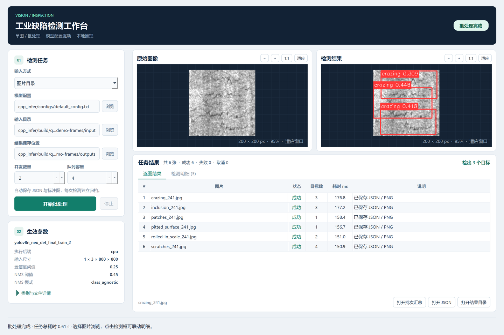
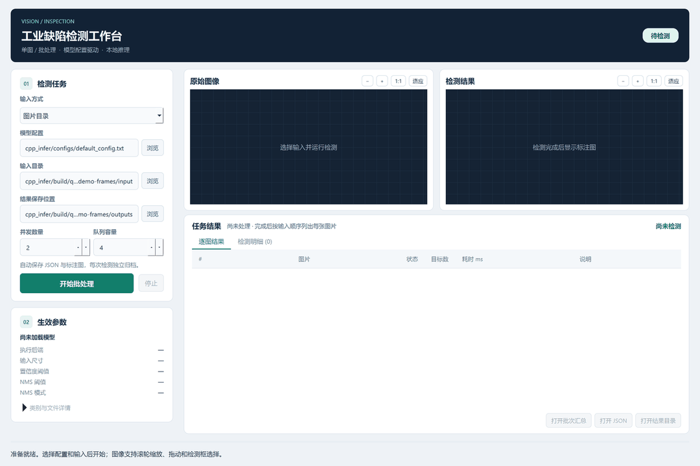
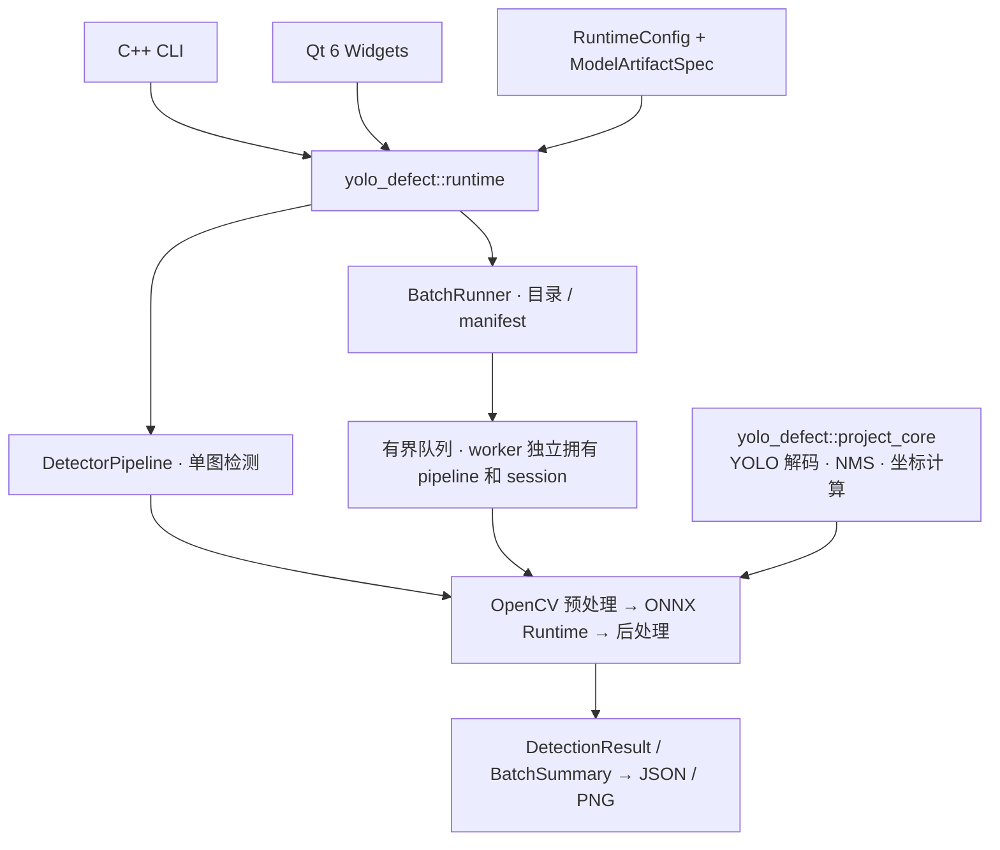

# 工业视觉边缘 AI Runtime 与 C++ 工程化系统

[English](README.md)

基于 C++17、CMake、OpenCV 和 ONNX Runtime 的工业表面缺陷检测系统，包含 Qt 桌面工作台和可复用的推理 Runtime，覆盖模型契约、FP32/INT8 推理、有界批处理、正确性校验及性能分析。

**[可视化演示 · Pages 发布后可访问](https://LiuSiChengGitHub.github.io/yolo_defect/)** · **[离线演示指南](docs/demo/index.html)** · **[Qt 运行说明](cpp_infer/apps/qt/README.md)** · **[C++ 技术手册](cpp_infer/README.md)**



<details>
<summary>短演示：检测、批次结果与图像查看</summary>



演示来自真实 Qt 客户端。UI 美化后，在已配置测试依赖及 Pillow 的环境中运行 `cpp_infer\tools\qt.cmd media`，即可重新生成截图和动图；捕获与更新流程见[演示指南](docs/demo/index.html)。

</details>

GitHub 会将离线 HTML 链接显示为源码。下载或克隆仓库后，用浏览器打开 `docs/demo/index.html` 即可查看；完成 Pages 发布后也可使用在线链接。指南不依赖 Web 服务。

## 项目展示的工程能力

| 模块 | 已实现能力 |
|---|---|
| 桌面应用 | Qt 6 Widgets；单图、目录及 manifest 输入；后台执行与协作停止；逐图失败反馈；缩放平移及检测框与表格联动 |
| 推理 Runtime | 配置与模型契约校验；OpenCV 预处理；ONNX Runtime CPU 推理；YOLO 解码、NMS 与坐标恢复；JSON/PNG 输出 |
| 有界并发 | 有界任务队列；每个 worker 独立拥有 pipeline/session；稳定结果顺序；逐项失败隔离与最终批次汇总 |
| 校验与分析 | Python/C++、GUI/CLI 结果比较；FP32/QDQ U8S8 INT8 流程；独立 benchmark、ORT profiling 与批次对比 |
| 跨平台 | Runtime 已验证 Windows x86_64、WSL2/Linux x86_64，以及 Linux AArch64 交叉构建和 QEMU 功能运行；Qt GUI 当前验收平台为 Windows x64 |

随仓库提供的 YOLOv8 模型检测 NEU-DET 六类缺陷：裂纹、夹杂、斑块、麻点、轧入氧化皮和划痕。FP32 与 INT8 通过配置切换，面向 Runtime 的输入输出均保持 float32 契约。

## 架构设计


```mermaid
flowchart TD
    CLI[C++ CLI] --> Runtime
    Qt[Qt 6 Widgets] --> Runtime
    Config[RuntimeConfig + ModelArtifactSpec] --> Runtime[yolo_defect::runtime]
    Runtime --> Single[DetectorPipeline · 单图检测]
    Runtime --> Batch[BatchRunner · 目录 / manifest]
    Batch --> Workers[有界队列 · worker 独立拥有 pipeline 和 session]
    Single --> Inference[OpenCV 预处理 → ONNX Runtime → 后处理]
    Workers --> Inference
    Core[yolo_defect::project_core<br/>YOLO 解码 · NMS · 坐标计算] --> Inference
    Inference --> Output[DetectionResult / BatchSummary → JSON / PNG]
```

`RuntimeConfig` 选择模型声明、provider 和阈值；`ModelArtifactSpec` 声明张量与处理语义；`ModelMetadata` 记录实际加载模型的信息。`DetectorPipeline` 组合一次检测，各个 `BatchRunner` worker 独立持有 pipeline 和 ORT session。

Qt 与 CLI 直接调用同一 Runtime。Qt 后台 worker 将同步调用适配为信号和值类型结果，GUI 通过 Runner 的线程安全接口请求协作停止，批处理调度仍由 Runtime 负责。逐图预览读取已保存的 JSON/图片，不重复推理；控件始终由 GUI 线程操作。

Qt 使用独立、可选的 CMake target，`YOLO_DEFECT_BUILD_QT` 默认关闭。Runtime、CLI 和无外部依赖的 core 构建不要求 Qt；布局、QSS、图像交互与后续主题资源留在客户端模块。

## 运行项目

### Windows 桌面工作台

需要 x64 MSVC 工具链、**Qt 6.2+ MSVC x64** SDK、OpenCV 4 和 ONNX Runtime C++ SDK 1.19.2。当前桌面验收使用 Qt 6.8.3。依赖准备与路径配置见 [Qt 客户端说明](cpp_infer/apps/qt/README.md#windows-x64-构建与启动)。

首次使用时，在仓库根目录复制本地配置示例，填入实际 SDK 路径；本地配置由 Git 忽略，已有配置无需重复复制：

```powershell
Copy-Item cpp_infer/tools/stage1.local.example.psd1 cpp_infer/.stage1.local.psd1
Copy-Item cpp_infer/tools/qt.local.example.psd1 cpp_infer/.qt.local.psd1
.\cpp_infer\tools\qt.cmd build
.\cpp_infer\tools\qt.cmd run
```

启动器预填 FP32 配置与样图，点击“运行检测”即可；切换到目录或 manifest 模式可执行批处理。运行时显示忙碌状态，完成后显示最终计数，不估算百分比。每次任务独立保存结果，默认位于 `results/qt/`。

在已配置的开发环境中生成可移动的 Windows 演示目录：

```powershell
.\cpp_infer\tools\qt.cmd package
```

默认输出到 `dist/yolo-defect-qt/`，可用 `-PackageDir <新的空目录>` 指定其他位置。打开其中的 `demo/index.html` 查看说明，通过 `run.cmd` 启动。打包内容、运行依赖和演示顺序统一见[离线指南](docs/demo/index.html)。

### Windows / Linux CLI

CLI 独立提供检测与分析功能。按[技术手册](cpp_infer/README.md#构建与依赖)配置依赖后，从仓库根目录执行。

<details>
<summary>Windows CLI 命令</summary>

```powershell
.\cpp_infer\tools\stage1.cmd build
.\cpp_infer\tools\stage1.cmd detect data\images\val\crazing_241.jpg
.\cpp_infer\tools\stage1.cmd batch data\images\val -Workers 4 -QueueCapacity 8
```

`stage1.cmd` 自动初始化 Visual Studio x64 环境，并读取 `cpp_infer/.stage1.local.psd1`。

</details>

<details>
<summary>Linux / WSL2 CLI 命令</summary>

```bash
export ONNXRUNTIME_ROOT=/path/to/onnxruntime-linux-x64-1.19.2
export YOLO_DEFECT_PYTHON=/path/to/python
export YOLO_DEFECT_GTEST_SOURCE=/usr/src/googletest
bash cpp_infer/tools/stage1.sh build
bash cpp_infer/tools/stage1.sh detect data/images/val/crazing_241.jpg
bash cpp_infer/tools/stage1.sh batch data/images/val --workers 4 --queue-capacity 8
```

</details>

CLI 的 `detect` 默认输出 JSON 和 PNG；`batch` 默认输出逐图 JSON 与汇总，通过 Windows 的 `-OutputImages` 或 Linux 的 `--output-images` 保存标注图。

**模型与样例：** 仓库已跟踪 `models/best.onnx` 和样例图像（包括 `data/images/val/crazing_241.jpg`），默认 FP32 演示无需另行下载模型。U8S8 INT8 模型是可复现的本地生成产物，未作为模型二进制提交；准备方法见[模型与样例获取](cpp_infer/README.md#模型与样例获取)。生成后，在 Qt 中选择 `cpp_infer/configs/int8_u8s8_config.txt`，或给 CLI wrapper 传入 `-Config` / `--config`。

## 仓库结构

| 位置 | 职责 |
|---|---|
| [`cpp_infer/apps/qt`](cpp_infer/apps/qt/) | 桌面控件、表格模型、图像交互与后台适配 |
| [`cpp_infer/include`](cpp_infer/include/) / [`cpp_infer/src`](cpp_infer/src/) | 公共契约、project core、推理 Runtime、批处理与 CLI |
| [`cpp_infer/configs`](cpp_infer/configs/) / [`cpp_infer/artifacts`](cpp_infer/artifacts/) | 运行选项与模型声明 |
| [`cpp_infer/tools`](cpp_infer/tools/) | 构建、启动、打包入口，量化、一致性与结果分析 |
| [`cpp_infer/tests`](cpp_infer/tests/) / [`cpp_infer/protocols`](cpp_infer/protocols/) | 单元/集成测试、输入 fixture 与可复现实验协议 |
| [`models`](models/) / [`data`](data/) | 已跟踪的 FP32 模型、图像/标签及本地派生模型 |
| [`scripts`](scripts/) / [`src`](src/) / [`api`](api/) | Python 训练、评估、推理与 API 工具 |
| [`docs/demo`](docs/demo/) / [`docs/assets/qt`](docs/assets/qt/) | 离线演示指南与可替换的展示素材 |

构建产物、机器 SDK 路径、演示包和运行结果由 Git 忽略；客户端运行不依赖 `tmp/`。

## 验证与性能分析

```powershell
.\cpp_infer\tools\qt.cmd test -Screenshots
.\cpp_infer\tools\stage1.cmd test
.\cpp_infer\tools\stage1.cmd consistency
.\cpp_infer\tools\stage1.cmd benchmark -Warmup 10 -Repeat 100
.\cpp_infer\tools\stage1.cmd batch-compare
```

Qt 集成测试比较 FP32/U8S8 与 CLI 的结果，覆盖损坏图片、输入顺序、界面响应、停止重启、运行中关闭，以及选择联动和缩放。Windows 原生检查还覆盖 200% 缩放与紧凑布局；环境及验收记录见 [Qt 说明](cpp_infer/apps/qt/README.md)。

CLI 流程还提供 `doctor`、`demo`、`clean-build` 和 `all`。Windows 提供 `profile` wrapper，两个平台的 C++ CLI 均支持 `--profile`；具体命令及计时定义见 [benchmark/profiling 手册](cpp_infer/README.md#benchmarkprofiling-与结果分析)。

Benchmark 使用独立、无插桩的 CPU session，排除 warmup，统计阶段耗时、P50/P95 和吞吐量。Batch throughput 为成功图片数除以 processing wall time。GUI 任务耗时包含准备和写出，不替代 benchmark。QEMU 记录的是模拟环境中的功能结果，不代表原生 ARM 性能；相关流程见 [AArch64 说明](cpp_infer/README.md#aarch64-交叉编译与-qemu)。

## 文档导航

| 文档 | 内容 |
|---|---|
| [可视化演示指南](docs/demo/index.html) | 演示目录、启动与操作说明、素材更新方式 |
| [Qt 客户端工程说明](cpp_infer/apps/qt/README.md) | 依赖配置、交互、线程归属与生命周期、测试和样式维护 |
| [C++ Runtime 技术手册](cpp_infer/README.md) | 依赖与模型准备、配置、CLI、输出协议和分析工具 |
| [默认配置](cpp_infer/configs/default_config.txt) / [模型声明](cpp_infer/artifacts/yolov8_neu_det.artifact.txt) | Runtime 与模型契约的实际示例 |

项目代码许可见 [LICENSE](LICENSE)，模型来源及产物许可单独记录在[模型声明](cpp_infer/artifacts/yolov8_neu_det.artifact.txt)中。
